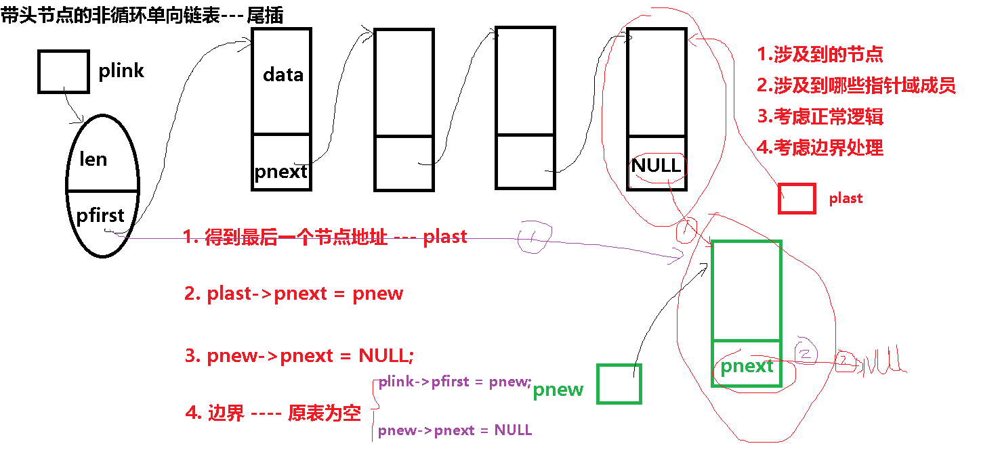
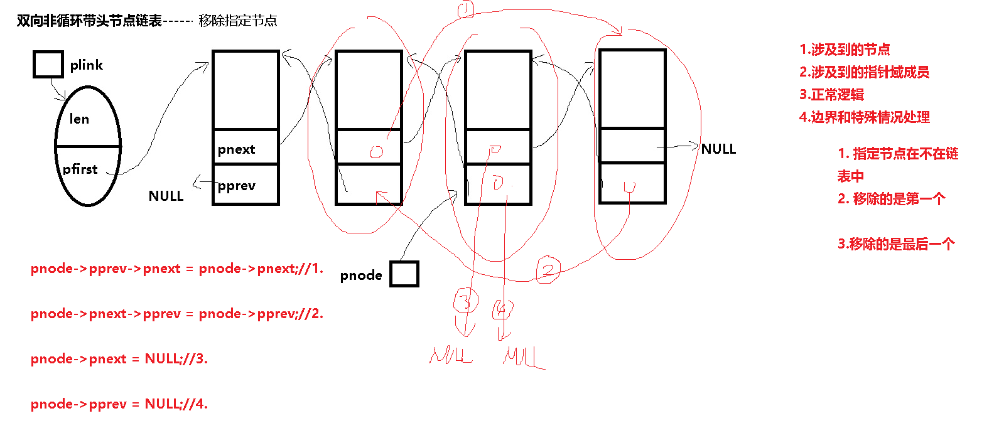

# 零、复习内容

1. C语言知识结构

   基础（树根）：语句、表达式、运算符、选择、循环

   核心（主干）：函数

   各分支（围绕主干的枝枝叶叶）：各种数据类型

2. 如何掌握一种数据类型

   从五个方面去掌握：

   1）sizeof

   2）变量定义和初始化

   3）支持的运算符和常用操作

   4）作为函数形参类型时的特点

   5）作为函数返回值类型时的特点

3. 整型作为函数返回值类型时的三种常用做法：

   1）返回具有实际意义的数值

   2）返回为0表示本次调用正常，负数表示出错

   3）作真假值用
   
4. 函数：

   声明：函数声明是为了协助编译器在编译过程中检查函数调用的语法是否正确

   

   定义：实现功能

   编写函数定义的思维步骤：

   1. 确定函数功能：原则尽量单一，同时按功能给函数命名

   2. 分析完成函数功能必须的前提条件，据此初步确定函数形参

   3. 分析如何将功能结果反馈给调用者，据此确定函数返回值以及最终的函数形参

   4. 分析完成功能的大体步骤

   5. 按步骤编写并验证代码

      

   调用：每调用一次就是使用一次函数功能

   被调函数的来源：

   1. 自定义函数
   2. 别人定义的函数：
      1. C语言标准函数库
      2. 系统调用（操作系统提供的函数）
      3. 各种各样的第三方函数库

   每次函数调用的全过程：

   1. 调用函数的地方先暂停执行后续步骤
   2. 向函数传递数据（即传参：把实参表达式赋值给形参）
   3. 跳转至函数体第一条语句处
   4. 按步执行函数体中的语句
   5. 函数执行结束后跳转回调用子程序的地方（可能伴随其它附加作用：如携带返回值）
   6. 调用函数的地方继续执行后续步骤

   其中第二步如何进行的呢？请记住如下步骤（背诵、至死不忘）：

   1. **挨个执行形参定义语句**

   2. **将实参表达式的值赋值给相应形参**
      C语言任何类型作为形参类型都是如此进行传参的，
      第1小步告诉我们形参列表就是形参定义语句列表，**形参也是变量**，形参定义语句和变量定义语句的基本作用是一样的，只是在用途、定义位置、初始化上有些区别；
      第2小步告诉我们**实参是表达式**，它的个数以及每个表达式的类型与函数定义的形参列表一 一对应，不能多也不能少。

      

5. 常见内存操作错误

   以下问题是常见的内存操作错误，也是C语言程序员的主要敌人： 

   1. 内存泄漏  

   2. 内存越界  

   3. 野指针 （未初始化的指针变量、指向已释放内存空间的指针变量）

   4. 试图改写只读数据区（字符串常量、const修饰的全局变量、const修饰的static局部变量）  

   5. 野值  

   6. 重复释放

      free函数出错无非两个原因：a. 传给free函数的地址值，不是malloc返回的地址值 b. 释放已释放的空间

   7. 栈溢出

      

6. C语言编程的两大基本原则

   a. 类型一致化

   	1. 赋值号两边
   	2. 形参与实参
   	3. 函数返回值类型与函数体中return后的表达式类型

   b. 程序中所有使用的内存空间必须是已知可控的内存空间

   	1. 明确空间什么时候被分配
   	2. 明确空间什么时候被释放
   	3. 明确空间的特殊性质

   

7. 动态分配与静态分配

   动态分配：通过调用malloc函数获得内存空间

   静态分配：通过变量定义语句获得内存空间

   动态分配：

    	1. 只有程序执行到相应位置通过变量表达式的计算才能获知空间大小的情况采用动态分配
    	2. 需要的内存空间太大（>512字节）时采用动态分配
    	3. 其它情况可以采用动态分配，也可以采用静态分配，尽量采用静态分配

   动态分配的代码模板：

   ```c
   //计算出所需空间的大小(单位字节)-----size
   //定义一个T *类型的指针变量pt
   pt = (T *)malloc(size);
   if(NULL == pt)
   {
       //出错处理
   }
   memset(pt,0,size);
   
   
   //.......使用动态空间的代码
   
   
   //一旦程序不再使用该动态空间，一定要记得及时调用free函数进行释放，否则会造成内存泄漏的错误
   free(pt);
   pt = NULL;
   ```

   

   


# 一、什么是数据结构？

数组、动态分配、指针、结构体、函数综合运用

数据结构就是研究同类型批量元素存储方式、逻辑关系及其相关操作的学科

逻辑关系

1. 0-0：同属一个集合。元素与元素之间不具备任何关联
2. 1-1：线性关系（线性表），可以由一个元素找到下一个或前一个元素
3. 1-n：树形关系，可以由一个元素找到多个元素
4. m-n：图形关系，多对多

存储方式

	1. 顺序存储
	2. 链式存储
	3. 顺序存储和链式存储组合而成的其它存储方式：静态链、索引存储....

# 二、线性表

线性表中的任何一个元素只能有0或一个后继 和 只能有0个或一个前驱

按存储方式分为：

1. 顺序表（数组）：采用顺序存储的线性表
2. 链表：采用链式存储的线性表

# 三、顺序表

操作对象------用来顺序连续存放同类型批量元素的一个数组

数组空间的来源方式：

1. 数组定义语句
2. 动态分配

顺序表中当前元素个数 ------- 表长

顺序表中最多存放的元素个数 ------- 表容量

```c
typedef 元素类型 T;//元素类型可以是任意非void类型

//本结构体本质是用来协助操作pt成员指向数组的引擎对象
struct seqlist
{
	T *pt;//指向空间为连续顺序存放T类型元素的数组空间
	int max;//表容量，pt指向空间最多可以存放的元素数目
	int len;//表长，记录从下标零开始连续元素的个数
};

建表：给引擎对象和存放批量元素的数组分配空间
struct seqlist *create_seqlist(int maxsize);

清空表：
int clear_seqlist(struct seqlist *pseq)
{
    pseq->len = 0;
    return 0;
}
    
删表：释放引擎对象和存放批量元素的数组空间
int destroy_seqlist(struct seqlist *pseq);

求表长
int get_seqlist_len(struct seqlist *pseq)
{
	return pseq->len;    
}

判空
int is_empty_seqlist(struct seqlist *pseq)
{
    return pseq->len == 0 ? 1 : 0;
}

判满
int is_full_seqlist(struct seqlist *pseq)
{
    return pseq->len == pseq->max ? 1 : 0;
}

插入
头插：新元素插入在下标最小的位置
int insert_at_head(struct seqlist *pseq,T *pnew);

尾插：新元素插入在len的位置
int insert_at_tail(struct seqlist *pseq,T *pnew);

在指定下标位置插入:
int insert_at_location(struct seqlist *pseq,T *pnew,int loc);

删除
头删：删除下标最小的元素
int delete_at_head(struct seqlist *pseq);    

尾删：删除下标为len-1的元素
int delete_at_tail(struct seqlist *pseq);

删除指定下标位置的元素：
int delete_at_location(struct seqlist *pseq,int loc);

修改:
int modify(struct seqlist *pseq,int loc,T *pdata);

查找：
int search_by_XXXXX(struct seqlist *pseq,??????);
    
排序
int sort_by_XXXXX(struct seqlist *pseq);
```

源码参考------seqlist

源码阅读辅助内存图：


# 四、链表

采用链式存储的线性表

由于每个元素都需要有成员保存其它元素的地址，因此元素类型只能是结构体类型

链表中的元素一般被称为节点、结点(Node）

链表中元素的结构体类型成员按基本作用分为两类：

1. 数据域------用于描述程序关心的某事物的一些属性
2. 指针域------用于存放其它节点的内存首地址

1. 按单向双向分 ---- 即指针域成员是一个还是两个

   单向链表 --- 一个指针域成员-----用于存放下一个节点的地址

   双向链表 --- 两个指针域成员-----一个用于存放下一个节点的地址，另一个用于存放前一个节点的地址

2. 按头节点分 ---- 即有没有辅助操作链表的引擎对象

   有头节点

   无头节点

   头指针：就是一个保存着链表中第一个节点地址的指针变量

3. 按是否循环分 ---- 即第一个节点和最后一个节点是否相连

   非循环链表

   循环链表

各操作函数实现思路：

1. 考虑本操作涉及到的节点（含头节点或头指针）
2. 考虑本操作到的结构体成员
3. 考虑正常逻辑的实现思路
4. 考虑所有边界情况（空表、第一个节点、最后一个节点等等）的特殊处理

八种链表：

1. 单向非循环带头节点

   ```c
   #ifndef PERSON_LINKLIST_H
   #define PERSON_LINKLIST_H
   
   #include <stdio.h>
   #include <stdlib.h>
   #include <string.h>
   
   #define NAME_LEN 20
   #define PHONE_LEN 20
   #define ADDR_LEN 64
   struct person
   {
   	char name[NAME_LEN];
   	char sex;
   	char phone[PHONE_LEN];
   	char address[ADDR_LEN];
   };
   typedef struct person T;
   
   struct node
   {
   	T data;
   
   	struct node *pnext;
   };
   
   struct linklist
   {
   	int len;
   	struct node *pfirst;
   };
   
   //建表：给引擎对象分配空间
   struct linklist *create_linklist();
   
   //清空表：将所有节点空间释放，置头节点的len成员为0，pfirst成员为NULL
   int clear_linklist(struct linklist *plink);
   
   //删表：先清空表，然后再释放头节点的空间
   int destroy_linklist(struct linklist *plink);
   
   //创建一个节点
   struct node *create_node(T *pdata);
   
   //销毁一个节点：释放节点占用的内存空间
   int destroy_node(struct node *pnode);
   
   //求表长
   int get_linklist_len(struct linklist *plink);
   
   //判空
   int is_empty_linklist(struct linklist *plink);
   
   
   //插入
   //头插：新节点插入链表，作为链表中的第一节点
   int insert_at_head(struct linklist *plink,struct node *pnew);
   
   //尾插：新元素插入链表，作为链表中的最后一个节点
   int insert_at_tail(struct linklist *plink,struct node *pnew);
   
   //在指定节点后插入新节点:
   int insert_at_after_node(struct linklist *plink,struct node *pnode,struct node *pnew);
   
   //移除
   //头移除：将第一个节点脱链
   struct node * remove_at_head(struct linklist *plink);
   
   //尾移除：将最后一个节点脱链
   struct node * remove_at_tail(struct linklist *plink);
   
   //移除指定节点
   int remove_a_node(struct linklist *plink,struct node *pnode);
   
   //修改:
   int modify(struct node *pnode,T *pdata);
   
   //查找：
   struct node * search_by_name(struct linklist *plink,char *name);
   
   //排序
   //
   //int sort_by_phone(struct linklist *plink);
   
   //打印所有联系人
   int print_all_person(struct linklist *plink);
   
   //打印一个联系人
   int print_a_person(struct node *pnode);
   
   #endif
   
   ```

   头插

   

   

   尾插

   

   

   指定节点后插入

   

   

   头移

   

   

   尾移

   

   

   

   移除指定节点

   

   另一种移除指定节点的方法：

   

   分析完整程序时的内存图：

   

2. 单向非循环不带头节点

3. 单向循环带头节点

4. 单向循环不带头节点

5. 双向非循环带头节点

   ```c
   #ifndef PERSON_LINKLIST_H
   #define PERSON_LINKLIST_H
   
   #include <stdio.h>
   #include <stdlib.h>
   #include <string.h>
   
   #define NAME_LEN 20
   #define PHONE_LEN 20
   #define ADDR_LEN 64
   struct person
   {
   	char name[NAME_LEN];
   	char sex;
   	char phone[PHONE_LEN];
   	char address[ADDR_LEN];
   };
   typedef struct person T;
   
   struct node
   {
   	T data;
   
   	struct node *pnext;
   	struct node *pprev;
   };
   
   struct linklist
   {
   	int len;
   	struct node *pfirst;
   };
   
   //建表：给引擎对象分配空间
   struct linklist *create_linklist();
   
   //清空表：将所有节点空间释放，置头节点的len成员为0，pfirst成员为NULL
   int clear_linklist(struct linklist *plink);
   
   //删表：先清空表，然后再释放头节点的空间
   int destroy_linklist(struct linklist *plink);
   
   //创建一个节点
   struct node *create_node(T *pdata);
   
   //销毁一个节点：释放节点占用的内存空间
   int destroy_node(struct node *pnode);
   
   //求表长
   int get_linklist_len(struct linklist *plink);
   
   //判空
   int is_empty_linklist(struct linklist *plink);
   
   
   //插入
   //头插：新节点插入链表，作为链表中的第一节点
   int insert_at_head(struct linklist *plink,struct node *pnew);
   
   //尾插：新元素插入链表，作为链表中的最后一个节点
   int insert_at_tail(struct linklist *plink,struct node *pnew);
   
   //在指定节点后插入新节点:
   int insert_at_after_node(struct linklist *plink,struct node *pnode,struct node *pnew);
   
   //移除
   //头移除：将第一个节点脱链
   struct node * remove_at_head(struct linklist *plink);
   
   //尾移除：将最后一个节点脱链
   struct node * remove_at_tail(struct linklist *plink);
   
   //移除指定节点
   int remove_a_node(struct linklist *plink,struct node *pnode);
   
   //修改:
   int modify(struct node *pnode,T *pdata);
   
   //查找：
   struct node * search_by_name(struct linklist *plink,char *name);
   
   //排序
   //
   //int sort_by_phone(struct linklist *plink);
   
   //打印所有联系人
   int print_all_person(struct linklist *plink);
   
   //打印一个联系人
   int print_a_person(struct node *pnode);
   
   #endif
   
   ```

   头插

   

   尾插

   

   指定节点后插入

   

   头移除

   

   尾移除

   

   移除指定节点

   

6. 双向非循环不带头节点

7. 双向循环带头节点

8. 双向循环不带头节点

循环链表的操作注意事项：

​		最后一个节点的判断逻辑变为-----某个节点的pnext 等于 phead->pfirst

​        如果是双向链表则，第一个节点pprev成员为最后节点的地址

不带头节点链表的操作注意事项：

​		操作函数如果不修改第一个节点，则传第一个节点的地址

​		操作函数如果会修改第一个节点，则传保存第一个节点地址的头指针变量的地址


# 五、特殊线性表------栈

插入移除在同一端进行的线性表（FILO先进后出  LIFO后进先出）

栈底

栈顶：插入和删除总是在栈顶进行

空栈：表长为0的栈

满栈：表长到达最大容量的栈


入栈称push ----- 在栈顶插入新元素

出栈称pop ---- 删除或移除栈顶元素


链式栈

顺序栈


# 六、特殊线性表------队列

插入在一端移除在另一端进行的线性表（FIFO先进先出  LILO后进后出）

队首：移除或删除总是在队首进行

队尾：插入新元素总是在队尾进行


入队称enqueue ：在队尾插入新元素

出队称dequeue：从队首删除或移除一个元素


链式队列


顺序队列:


做成环状，以重复利用head前的元素空间

解决区分空和满的三种方法：

1. 设置标记

2. 空余一个元素位置不用，则 head == tail为空，而（tail + 1）% max == head为满

3. 记录有效元素个数

   

# 七、二叉树

树

树是一种非线性的数据结构，是由n（n >=0）个结点组成的有限集合。
如果n==0，树为空树。
如果n>0，
树有一个特定的结点——根结点：只有直接后继，没有直接前驱。
除根结点以外的其他结点划分为m（m>=0）个互不相交的有限集合，T0，T1，T2，...，Tm-1，每个集合是一棵树，称为根结点的子树


结点的度：子结点的个数，度为0的结点被称为叶子结点

树的度：结点度的最大值

树中根结点为第1层，根结点的孩子为第2层，依次类推。
树中结点的最大层次称为树的深度或高度或层数


森林是由n棵互不相交的树组成的集合

父子

子孙-祖先

兄弟、堂兄弟


二叉树：树中包含的各个节点的度不能超过 2，即只能是 0、1 或者 2

满二叉树：如果二叉树中除了叶子结点，每个结点的度都为 2，且所有叶子结点必须在同一层上，则此二叉树称为满二叉树

完全二叉树:如果二叉树中除去最后一层节点为满二叉树，且最后一层的结点依次从左到右分布，则此二叉树被称为完全二叉树


二叉树存储方式：

1. 顺序存储：只用在完全二叉树上

2. 链式存储

   

遍历：

先序

```c
void preorder(struct node * root)
{
    if(NULL == root)
    {
        return;
    }
    
	usingroot(root);
	preorder(root->lchild);
	preorder(root->rchild);
}
```


中序

```c
void inorder(struct node * root)
{
    if(NULL == root)
    {
        return;
    }
    
	inorder(root->lchild);
	usingroot(root);
	inorder(root->rchild);
}
```


后序

```c
void postorder(struct node * root)
{
    if(NULL == root)
    {
        return;
    }
    
	postorder(root->lchild);	
	postorder(root->rchild);
	usingroot(root);
}
```


特殊的二叉树：二叉搜索树（Binary Search Tree）

也称有序二叉树（ordered binary tree）,排序二叉树（sorted binary tree），是指一棵空树或者具有下列性质的二叉树：

　　1. 若任意节点的左子树不空，则左子树上所有结点的值均小于它的根结点的值；
    
  2. 若任意节点的右子树不空，则右子树上所有结点的值均大于它的根结点的值；

  3. 任意节点的左、右子树也分别为二叉查找树。

  4. 没有键值相等的节点（no duplicate nodes）

     

特殊的二叉搜索树：

1. AVL树：完全平衡二叉树  Adel’son-Vel’skii 和Landis：

   1. 左子树与右子树高度之差的绝对值不超过1

   2. 树的每个左子树和右子树都是AVL树

   3. 每一个节点都有一个平衡因子（balance factor），任一节点的平衡因子是-1、0、1（每一个节点的平衡因子 = 右子树高度 - 左子树高度）

      

2. 红黑树： 不完全平衡    鲁道夫.贝尔

   1. 每个结点要么是红的要么是黑的。  
   2. 根结点是黑的。  
   3. 每个叶结点（叶结点即指树尾端NIL指针或NULL结点）都是黑的。  
   4. 如果一个结点是红的，那么它的两个儿子都是黑的
   5.  从任一节结点到其每个叶子的所有路径都包含相同数目的黑色结点 

   

# 八、算法

所谓算法就是完成某个操作或解决某个问题的方法步骤

算法五个基本特征：

1. 有穷性
2. 可行性
3. 0个或多个输入
4. 1个或多个输出
5. 确切性 -- 每一步不能有二义性

算法衡量：

1. 时间复杂度：算法开始执行到结束所花费的时间T 和 问题规模n 呈现什么样的数学函数关系
2. 空间复杂度：算法开始执行到结束所花费的辅助空间S 和 问题规模n 呈现什么样的数学函数关系

大O表示法

常数阶O(1),对数阶O(log2n),线性阶O(n),线性对数阶O(nlog2n),平方阶O(n^2)，立方阶O(n^3),...

噩梦阶O(n^n）


# 九、常见查找算法

无序数组：

1. 顺序查找

2. 哨兵法

   ```c
   #define N 5
   int arr[N + 1] = {66,88,55,33,99};
   int num = 52;//被查找的数
   int i = 0;
   
   arr[N] = num;
   for(i = 0;arr[i] != num;i++)
   { 
   }
   
   if(i == N)
   {
       printf("Not find\n");
   }
   else
   {
       printf("find %d at %d\n",num,i);
   }   
   
   ```

   

有序数组：

1. 折半查找

2. 插值查找 ----- 用在元素差值分布比较平均的场合

   插值公式：low + ((key - a[low]）* (high -low))/ (a[high] - a[low]) 

特殊特征的数组：

1. hash查找：找到被查找元素的值与存储下标之间的数学函数（hash函数）关系
2. 索引查找：先对被查找的元素建立一定特征的索引数组，查找时在索引数组中进行

# 十、常见数组排序算法 

排序稳定性：元素值相等的多个元素，排序前和排序后位置没有发生变化，则称该排序算法是**稳定的**排序算法

1. 基本排序

   冒泡 选择 插入

   时间复杂度：O(n*n)

   空间复杂度：O(1)

   稳定性：稳定

2. shell排序：升级版插入排序，又叫缩小增量的插入排序

   时间复杂度：O(n的1.几次方)

   空间复杂度：O(1)

   稳定性：不稳定

3. 快速排序

   

   

   时间复杂度：O(n*log2底n)
   
   空间复杂度：O(n*log2底n)
   
   稳定性：不稳定

其它排序：归并排序、堆排序、桶排序、。。。。。。。。。。

# 十一、链表排序

1. 硬排序

   插入排序：

   ​	1>先编写两个插入函数：

   ​		insert_between_nodes：已知两个连续节点的地址，在它们之间插入新节点

   ​        insert_after_last_node：已知最后一个节点的地址，在它之后插入新节点

   ​    2>定义头节点变量head

   ​    3> 将原表拆成两个链表，原表中仅剩第一个节点，其它剩余节点链进head链表中

   

   ​    4> 循环头移head链表中的每个节点，将移出的节点与原表中的每个节点按指定数据成员进行比较，如果小于某个原表节点的值则插入该节点前，如果大于则比较下一个节点直到最后一个节点,然后新节点插入最后一个节点之后

2. 借助数组

   1>分配一块内存空间，表长 * sizeof(struct node *）

   2>然后将链表每个节点的地址存入该空间

   3>再对该内存空间中元素，按其指向节点某个数据域成员大小进行排序

   4>使用存放着排序结果的内存空间

   5>不再使用该排序结果的内存空间时，立即释放该空间

   

   struct node **sort_person_linklist(struct linklist *plink);

   int print_sort_result(struct node **ppsort);

   int free_sort_mem(struct node **ppsort);

3. 数据域成员为指针


