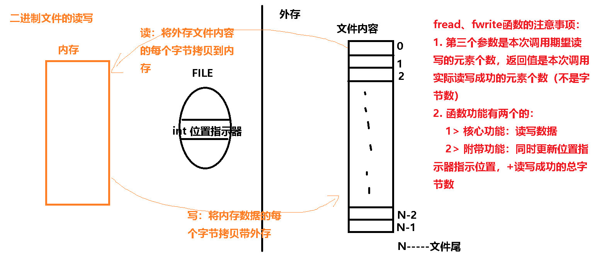

预备知识：

1. 操作引擎：为了方便操作某个较为复杂的对象，一般需要创建一个辅助对象将操作过程中用到的各种控制信息归拢在一起，这样辅助对象往往被称操作某某的引擎或操控器，显然一个引擎往往用结构体来描述（例如：带头节点的链表中头节点其实就是操作链表用的引擎、表示顺序表的结构体其实就是操作对应数组的引擎）

2. Linux下文件有7种，本章主要针对的其中的普通文件，普通文件分为文本文件和非文本文件

3. 为了方便读写普通文件内容，文件的操作引擎里有一个位置指示器成员，用于控制读写文件的起始位置，因此：

   1. 每次读写操作都是从位置指示器指示位置开始
   2. 每次读写成功n个字节，对应的读写函数都会变更位置指示器的指示位置（变更方法+n）

4. 文件的操作函数有两套：一套来自C语言标准函数库----标准IO（本章），另一套来自操作系统内核----系统IO

     标准IO函数的·实现依赖于系统IO

5. 学习任何一个函数的调用，需要先弄清：

   1. 该函数的功能（所有功能：主要功能+隐藏功能）

   2. 每个形参的作用

      当一个形参是指针类型时，该函数有三种使用该形参的可能：

      1. 值参数：只读其指向空间的内容 ------ 调用前需要准备好空间，并还要在空间中准备好内容
      2. 结果参数：只向其指向空间填写新内容 -----调用前只需要准备好空间，调用后使用空间中的内容
      3. 值-结果参数：既要读其指向空间的内容又要向其指向空间填写新内容 -------调用前需要准备好空间，并还要在空间中准备好内容，调用后使用空间中的新内容

   3. 返回值的作用


# 一、fopen

FILE *fopen(const char *path,const char *mode)

函数功能：创建一个文件操控器（或者称为操作引擎）,此后用此操控器操作对应的文件，同时指定操作对应文件的模式

返回值：失败返回NULL，成功返回文件操控器的内存地址

形参：

 1. path：其指向空间是一个字符串，字符串内容为带路径的文件名

 2. mode:其指向空间是一个字符串，字符串的内容将决定对此文件的操作模式

    "r":只读方式打开

    “w”：只覆盖写方式打开

    “a”：只追加写方式打开

    “r+”：读方式打开后可写（覆盖写）

    “w+”：覆盖写方式打开后可读

    “a+”：追加写方式打开后可读

| mode | 文件不存在 | 文件存在                     | 打开后能做的操作   | 初始位置指示器                         |
| ---- | ---------- | ---------------------------- | ------------------ | -------------------------------------- |
| “r”  | 打开失败   | 打开成功                     | 只读               | 0                                      |
| “w”  | 创建新文件 | 打开成功，但原文件内容被清空 | 只写（覆盖写）     | 0                                      |
| “a”  | 创建新文件 | 打开成功，但原文件内容保留   | 只写（追加写）     | 文件尾（并且每次追加写后都指示文件尾） |
| “r+” | 打开失败   | 打开成功                     | 可读可写（覆盖写） | 0                                      |
| “w+” | 创建新文件 | 打开成功，但原文件内容被清空 | 可读可写（覆盖写） | 0                                      |
| “a+” | 创建新文件 | 打开成功，但原文件内容保留   | 可读可写（追加写） | 文件尾（并且每次追加写后都指示文件尾） |

't’：文本文件，可省略

'b': 非文本文件（二进制文件）   “rb”  “ab+”


代码模板：

```c
FILE *pf = NULL;

pf = fopen("./test.txt","r");
if(NULL == pf)
{
    //出错处理
    //失败原因：1. 对于r方式（“r”或“r+”）打开，可能是文件不存在，也可能是没有读权限
    //         2.对于w或a方式打开，可能是外存空间不足或可能是对应目录没有写权限，也可能是没有写权限
}

/*
	文本文件的读写函数：fgetc fputc  fgets fputs fprintf fscanf
	非文本文件的读写函数：fread fwrite
	位置指示器的操作函数：fseek ftell
*/
    
fclose(pf);
pf = NULL;
```


# 二、fclose

int fclose(FILE *pf)

函数功能：销毁指定的文件操控器（指定文件的引擎对象）

形参：被关闭的文件操控器的内存地址

返回值：成功0，失败-1


# 三、位置指示器操作函数

int fseek(FILE *pf,long offset,int whence)

函数功能：修改位置指示器的指示位置

返回值：成功为0，失败-1(EOF)

参数：

​	pf：文件操控器的内存地址

​    offset：偏移量

   whence：

​		SEEK_SET:相对于文件头

​		SEEK_END:相对于文件尾

​	    SEEK_CUR:相对于位置指示器的当前指示位置


long ftell(FILE *pf)

函数功能：获取位置指示器当前指示位置

参数：

​	pf:文件操控器的内存地址

返回值：正常返回当前指示位置，失败-1


示例：

1. 计算文件大小
2. 各种打开模式初始位置指示器的指示位置


**每个读写函数都伴随着位置指示器的变更即：**

**1. 非追加写和读成功多少字节的数据，位置指示器就加多少**

**2. 追加写之前，写函数都会先将位置指示器指示到文件尾然后写数据，写完再变更位置指示器到新的文件尾**

# 四、文本文件读写函数

文本文件：其本质还是二进制文件，只不过它的每个字节都是字符的编码值，文件内容的这些字符都是可阅读可打印的字符（包括空白字符）

读写文本文件内容也可以使用fread、fwrite，只是不太方便，因此C语言标准函数库提供一套更方便的读写文本文件的函数。

专门读写文本文件的函数，不适用于非文本文件。

文本文件的读写函数与fread、fwrite一样都有附带功能：每次从指示器指示位置开始读写，并变更指示器指示位置

int fgetc(FILE *pf)

函数功能：从已打开的文件中读取一个字符

参数：pf： 文件操控器的内存地址（代表已打开的文件）

返回值：正常返回读取字符的ASCII码值，失败-1


int fputc(int c,FILE *pf)

函数功能：向已打开的文件中写入一个字符

参数：

​	pf： 文件操控器的内存地址（代表已打开的文件）

​    c：被写字符的ASCII码值

返回值：正常返回被写字符的ASCII码值，失败-1

stdin -- C库的全局变量，其类型是FILE *，它是标准输入文件（键盘设备）的操作引擎在内存中首地址

stdout -- C库的全局变量，其类型是FILE *，它是标准输出文件（命令行界面--屏幕）的操作引擎在内存中首地址

stderr -- C库的全局变量，其类型是FILE *，它是标准错误输出文件（命令行界面--屏幕）的操作引擎在内存中首地址

char *fgets(char *s,int size,FILE *pf)

函数功能：从已打开的文件中读取字符串到指定空间

参数：

​	s：指向空间用来存放读取的字符串

​    size：指示本次读取的最大有效字符个数（size - 1）

​	pf:文件操控器的内存地址（代表已打开的文件）

返回值：成功返回s指向空间的首地址，失败返回NULL

备注：

1. **每次读取要么读到行尾，要么读size-1字符 （不会跨行读取字符串）**
2. '\n'也作为有效字符来读


int fputs(const char *s,FILE *pf)

函数功能：将指定字符串写入到已打开的文件中

参数：

​	s:指向空间存放着被写的字符串

​    pf：文件操控器的内存地址（代表已打开的文件）

返回值：正常返回写成功的字符个数，失败-1


int fprintf(FILE *pf,const char *format,...)  

函数功能：将组织好的格式化字串写入到已打开的文件中

参数：

​	pf：文件操控器的内存地址（代表已打开的文件）

​	format以及...:同printf

返回值：正常返回向文件中写入的字符个数，失败返回负数

```c
printf(“....”,?,?,?) ===> fprintf(stdout,“....”,?,?,?);
int fprintf(....) 
{
    sprintf(....);
    
    fputs(...);
}
```


int fscanf(FILE *pf,const char *format,...)

函数功能：从指定文件中扫描指定格式的数据

参数：

​	pf：文件操控器的内存地址（代表已打开的文件）

   format以及...:同scanf

返回值：成功返回匹配成功的数据个数，失败-1

```
scanf("...",?,?,?) ======>fscanf(stdin,"...",?,?,?);

int fscanf(.....)
{
	fgets(....);
	
	sscanf(.....);
}
```


# 五、非文本文件的读写

读写函数的附带功能：读/写成功n个字节的同时，位置指示器会+n 

​                                     (追加写除外，追加写成功任意字节，位置指示器都指示到新的文件尾)

size_t  fread(void *ptr,size_t size,size_t nmemb,FILE *pf)

函数功能：从已打开的文件中读取nmemb个元素（每个元素占size个字节）到ptr指向的空间中

参数：

​	ptr：指向空间用来存放读到的数据

​	size：每个元素的空间大小

​	nmemb：期望读取的元素个数

​	   pf：文件操控器的内存地址（代表已打开的文件）

返回值：正常返回实际读到的**元素个数**，失败0


size_t  fwrite(const void *ptr,size_t size,size_t nmemb,FILE *pf)

函数功能：将ptr指向的空间中nmemb个元素（每个元素占size个字节）写入到已打开的文件中

参数：

​	ptr：指向空间用存放着待写入的数据

​	size：每个元素的空间大小

​	nmemb：期望写入的元素个数

​	   pf：文件操控器的内存地址（代表已打开的文件）

返回值：正常返回实际写入的元素个数，失败0



对于非文本文件需要在明确文件内容的布局（又称文件格式：即各字节的作用和排列次序）下进行读写：

1. 读写一个或多个基本类型
2. 读写一个或多个结构体类型数据（所谓布局一致就是所占空间大小相同，成员次序也相同）
   1. 结构体内存布局与在文件中的布局不一致的情况
      1. 写时，将结构体成员分开按文件格式规定次序挨个往文件里写
      2. 读时，按文件格式规定次序从文件中一个一个地读出数据到指定成员空间中
   2. 结构体内存布局与在文件中的布局一致的情况-------整体进行读写

# 六、项目中文本文件和非文本文件的选择

实际企业项目中，可能存在两种情况：

1. 文件格式已经确定好，程序员无权做主

   程序员首先需要根据相关文档，弄清楚文件格式，然后才能编写读写文件相关的代码

   所谓文件格式就是指一篇文章，用来描述文件内容的组织方式：

   文本文件的格式：一般描述较为简洁，说清楚每行字符内容的组织顺序就可

   非文本文件格式：一般描述较为繁杂，因为不同的字节或连续几个字节作用会完全不同

2. 文件格式已经未确定好，程序员做主

   1.  文本文件，对用户较为友好，方便用户阅读修改

   2. 非文本文件，对程序员较为友好，因为用文本文件存放大多时候需要编写字符串处理相关的额外代码，但对用户不友好，因为用户用文本查看软件打开非文本文件看到的是乱码（看到的是不按自然语言词法语法组成的、有着很多奇怪符号的、没有含义的内容）

   3. 有时候要根据实际情况考虑是用文本文件形式还是非文本文件形式更省外存空间，比如：

      已知10个整数，每个整数不超过1000，此时用文本形式更省外存空间

      已知10个整数，每个整数都会超过1000，则此时用非文本形式更省外存空间

      


