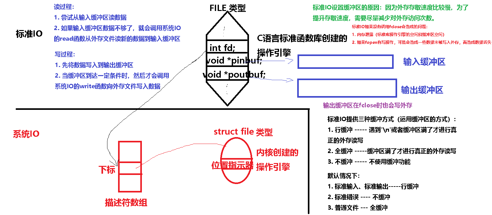

程序：

1. 裸机程序：直接运行在硬件之上
2. 应用程序：只能运行在对应操作系统之上

操作系统：给应用程序提供运行环境的裸机程序


# 一、操作系统发展史

无操作系统

批处理系统

多道任务系统

分时多任务系统

# 二、多任务操作系统框架

任务管理

内存管理

设备管理

文件管理

网络管理

启动管理

# 三、系统调用分类

任务控制 ---- 进程、线程 重点
文件系统控制 ----- 重点
系统控制（如reboot、time等等）
内存管理（如brk、mmap等等）
网络管理 ------ 重点
用户管理
进程间通信 ---- 重点

# 四、阻塞与非阻塞

某些系统调用函数完成其功能，需要满足一定的条件，当条件不满足时，可能采用如下两种措施：

1. 阻塞方式：一直等待到条件满足，此时调用该函数的程序将进入睡眠状态，此时该函数被称为阻塞型函数

2. 非阻塞方式：立即返回错误，此时该函数被称为非阻塞型函数

   

如果调用函数的程序必须成功调用该函数的功能后才能继续执行后续代码，则可以：

1. 让该函数采用阻塞方式

   

2. 对于非阻塞型函数，则可以循环调用该函数，直到某一次函数返回正常（轮询方式）

   


学习系统调用的方法：

1. 理解相关概念：操作系统 阻塞非阻塞是所有系统调用函数都要涉及的概念
2. 学会代码模板


# 五、文件种类和文件系统

Linux下的七种文件：

1. -：普通文件，外存中有文件内容的文件    open close read write lseek
2. d：目录文件，外存中内容为子目录名和文件名的文件  opendir closedir readdir
3. l：软链接，外存中内容为另一个文件路径的文件 symlink link unlink
4. b：块设备文件，这样的文件代表一个块设备（与该设备的数据交互以块为单位） 
5. c：字符设备文件，这样的文件代表一个字符设备（与该设备的数据交互以字节为单位） 同普通文件操作函数
6. p：管道文件，这样的文件代表一个叫有名管道的进程间通信机制  同普通文件操作函数
7. s：本地socket文件，这样的文件代表本地socket编程中一端的身份标识   除open外其它同普通文件操作函数


普通文件在外存中需要存放三种信息：

1. 文件名
2. 文件元信息（各种时间戳、用户、用户组、操作权限等等） ----- stat access
3. 文件内容


文件系统：所谓文件系统就是外存中组织、存储各种文件的方案

编写类似资源管理器这样的软件，必须搞清楚被访问分区采用的文件系统

Linux下ext文件系统简介（了解）


inode用于存放元信息，对于普通文件其中还存放着文件内容所用块的编号

# 六、文件元信息相关系统调用

int fstat(int fildes, struct stat *buf);
**int stat(const char *path, struct stat *buf); ----- 掌握（重点）**
int lstat(const char *path, struct stat *buf);
功能：读取指定文件或目录的状态信息即元信息
返回：执行成功则返回0，失败返回 < 0
参数：
	fildes：与指定文件关联的文件描述符
	path：通过路径名加文件名来指定文件
	buf：用于保存指定文件的元信息

**int access(const char *pathname, int mode);（重点）**
功能：测试当前用户对指定文件的访问权限
返回：执行成功则返回0，失败返回<0
参数：
	pathname：带路径的文件名或目录名
	mode：指定所要测试的权限
		R_OK 测试读权限
		W_OK 测试写权限
		X_OK 测试执行权限
		F_OK 测试文件是否存在
		可位或上述常量，同时进行测试

# 七、系统IO函数

文件描述符：

操作系统在程序调用open函数时，会创建一个操作对应文件引擎对象，为了方便管理这些引擎对象，操作系统会将这些引擎对象的内存首地址填写到一个数组（描述符数组）中(从下标0开始检查对应下标位置的地址是不是NULL，如果是NULL则新引擎对象的地址就填在该位置，并将该位置下标作为open函数的返回值返回)

**因此所谓的描述符其实就是操作系统内核中专门用来存放各种引擎对象地址的数组的下标**

**open：（重点）**

int open(const char *pathname,int flag)

int open(const char *pathname,int flag,mode_t mode)//在有新文件被创建时调用

功能：在OS内核中产生一个操作指定文件的引擎，返回值该引擎的整型身份ID（文件描述符 >= 0,小于0为无效描述符）

参数：

​		pathname：指向空间为字符串，字符串内容为带路径的文件名

​		mode：当有新文件被创建时，用来指定新文件的操作权限（八进制常量 或 对应常量宏位或）通常写0666

​		flag：

​				O_RDONLY：只读  

​				O_WRONLY：只写

​				O_RDWR：既可读又可写

​				O_APPEND：写为追加写

​				O_CREAT：如果文件不存在则创建新文件（此时open需三个形参）

​				O_TRUNC：如果可写，则原文件内容被清除

```c
fopen模式与open模式的对应关系：
"w"  ---------  O_WRONLY | O_CREAT | O_TRUNC
"a"  ---------  O_WRONLY | O_CREAT | O_APPEND
"r"  ---------  O_RDONLY
"w+"  ---------  O_RDWR | O_CREAT | O_TRUNC
"a+"  ---------  O_RDWR | O_CREAT | O_APPEND
"r+"  ---------  O_RDWR
```

**close：（重点）**

int close(int fd)

功能：将OS内核中fd代表操作引擎销毁掉

参数：

​	fd：以open文件的描述符

返回值：成功为0,失败-1

​		

操作位置指示器的函数（仅针对普通文件和支持位置指示器的个别设备文件）

**lseek：**

off_t lseek(int fd,off_t offset,int whence)

功能：改变位置指示器的指示位置，并返回新的指示位置

参数：

​	fd：已打开的文件描述符

​	offset、whence：同fseek

返回值：成功为新的指示位置，失败-1


**ftell** -----> lseek(fd,0,SEEK_CUR)


​			


读写数据的函数

read：（重点）

ssize_t read(int fd,void *buf,size_t count)

函数功能：从fd关联的文件中期望读count字节到buf指向的内存空间中，函数返回本次实际读到的字节数 


write：（重点）

ssize_t write(int fd,const void *buf,size_t count)

函数功能：将buf指向的内存空间中数据写到fd关联的文件中，期望写入count个字节，函数返回本次实际写入的字节数 


对已打的文件描述符做一些控制操作（比如修改flag）

fcntl ： 对描述符对应的、Linux内核创建的文件操作引擎 的一些属性成员进行读取、设置等操作


对设备属性操作函数

ioctl：专门用于设备文件，对该文件对应的设备的属性进行读取、设置等的操作


# 八、标准IO和系统IO

标准IO：文件的IO操作函数来自于C语言标准函数库

系统IO：文件的IO操作函数来自于操作系统内核

项目中：对于普通文件多数选择用标准IO函数

​               对于Linux下的特殊文件选择用系统IO

Linux下标准IO函数是通过调用系统IO函数实现的




标准IO相对于系统IO的优势：

1. 跨平台
2. 操作普通文件时更便利
3. 标准IO会减少对外存的操作次数（缓冲机制）


标准IO中的FILE *有时也被称为文件流

文件流：流的概念可以和生活中的流相对应。在生活中有水流和电流，首先要有一个源头，还需要有传输的管道，水流有河道、水管作为传输管道，电流有电线，而这些流都会有一个目的地，就是它的流向，文件流就是指内存数据与文件之间传输通道，很显然分为：

输入流：数据从文件流向内存的通道（从文件读）

输出流：数据从内存流向文件的通道（向文件写）


行缓冲：标准IO在输入和输出中遇到换行符时执行IO操作；注意，当流涉及终端的时候，通常使用的是行缓冲

全缓冲：在填满标准IO缓冲区之后才进行实际的IO操作；注意，对于驻留在磁盘上的文件来说通常是由标准IO库实施全缓冲。调用fflush函数冲洗一个流。冲洗意味着将缓冲区的内容写到磁盘上

不缓冲：标准错误是不带缓冲的


几个的特殊的文件：

1. 标准输入设备（键盘）：描述符为0，C库中用全局变量stdin（FILE *）来表示
2. 标准输出设备（命令行界面、屏幕）：描述符为1，C库中用全局变量stdout（FILE *）来表示
3. 标准错误设备（命令行界面、屏幕）：描述符为2，C库中用全局变量stderr（FILE *）来表示

# 九、目录IO函数

mkdir  创建目录  --- mkdir命令
rmdir  删除空目录   ----rmdir命令
chdir   改变工作目录 --- cd命令
getcwd  获取当前工作目录 --- pwd命令

opendir 打开目录流  ----- 重点
readdir  读目录的每一项 ----- 重点
telldir  返回操作目录的位置
seekdir 设置目录项的位置
closedir 关闭目录流 ---- 重点


重点：

opendir 打开目录流（重点）

DIR *opendir(const char *name)

功能：创建操作指定目录的一个操控器（操作引擎），返回操控器的地址，此后用此地址值代表被操作的目录

参数：

​	name：指向空间存放着一个字符串，字符串内容为带路径的目录名


readdir  读目录的每一项（重点）

struct dirent *readdir(DIR *dirp)

功能：读取指定目录下的一项内容（Linux7种文件中的一种），并且将目录指示器指示到下一项内容

参数：

​	dirp：操控器地址值，代表着已打开目录

返回值：成功返回有效地址，失败NULL

```c
struct dirent
{
	ino_t d_ino;
	off_t d_off;
	unsigned short d_reclen;
	unsigned char d_type;//本项是7种文件中的哪一种
	char d_name[256];
}
d_type:DT_BLK DT_CHR DT_REG DT_FIFO DT_SOCK DT_DIR DT_LNK
```


closedir 关闭目录流（重点）

int closedir(DIR *dirp)

功能：销毁指定的目录操控器

返回值：成功为0，失败-1


课堂示例：显示指定目录下的名称以.c结尾的所有普通文件

课堂练习：显示指定目录下的所有项的名字，如果是子目录则需显示子目录下所有项名字

# 十、链接相关函数

## 软链接


## 硬链接


int  unlink(const  char *  path);（重点）


int  link(const  char *  path1, const  char *  path2);//创建硬链接

int  symlink(const  char *  path1, const  char *  path2);//创建软链接


# 十一、权限操作函数

int  chmod(const  char *  path,  mode_t  mode);

int  chown(const  char *  path, uid_t  owner,   gid_t   group);


# 十二、内存映射

void * mmap(void * addr,  size_t  len,  int prot, int flags, int fildes, off_t off);（重点）
功能：创建一个指向一段内存的指针，这段内存与文件内容相关联
返回值：成功返回被映射内存空间的首地址， 失败为NULL
参数：
	addr：请求使用某个特定的内存地址，为NULL时自动分配
	len：被映射内存空间的大小
	prot：内存段访问权限（见下一页）
	flags：控制程序对内存段的改变所造成的影响
	fildes：打开的文件描述符
	off：文件内容的起始偏移值

| **PROT_READ**  | **允许读内存段**   |
| -------------- | ------------------ |
| **PROT_WRITE** | **允许写内存段**   |
| **PROT_EXEC**  | **允许执行内存段** |
| **PROT_NONE**  | **不能访问内存段** |

| **MAP_PRIVATE** | **对内存段的存储操作导致创建该映射文件的一个私有副本。修改只对该副本，而不是原始原件** |
| --------------- | ------------------------------------------------------------ |
| **MAP_SHARED**  | **把对该内存段的修改保存到指定文件中**                       |
| **MAP_FIXED**   | **该内存段必须位于addr指定的地址处**                         |


int msync(void * addr,  size_t  len,  int flags);（重点）
功能：控制被映射的内存段内容如何同步到对应文件里
返回值：成功为0，出错为 < 0
参数：
	addr：被映射内存空间的首地址
	len：被映射内存空间的大小
	flags:MS_SYNC、MS_ASYNC、MS_INVALIDATE（通知使用该共享区域的进程，数据已经改变）


int munmap(void * addr,  size_t  len);（重点）
解除映射时并不同步数据到对应文件


注意：mmap方式不能直接对文件内容进行追加，如果非要实现追加可以采用下面的方式：

1. 先向文件追加n个字节的0
2. mmap
3. 再对n个0位置进行修改


# 十三、命令补讲

```shell
#type
#功能：打印命令种类
#Linux命令分类：
#         内部命令：命令行界面程序内部提供的功能
#         外部命令：命令功能由对应应用程序提供
#用法： type   命令字
#示例：
type cd  #cd是shell内嵌的 ---- cd是内部命令
type cp  #cp ---- /bin/cp  ----cp是外部命令

#grep
#功能：在指定目录下的所有文件里或指定文件里查找指定的字符串
#用法：
grep  "指定的字符串" dirname1 dirname2 -r -n
grep  "指定的字符串" filename1 filename2 -n

#tar --- 打包解包
#打包：
tar cvf 包文件名.tar  #被打包的带路径的文件名或目录名 

#打包并压缩： z-----zip压缩算法
tar zcvf 包文件名.tgz/.tar.gz  #被打包的带路径的文件名或目录名 

#解包：
tar xvf 包文件名.tar #解包在当前目录下
tar xvf 包文件名.tar -C 目录名 #解包在指定目录下

#解压缩后再解包：
tar zxvf 包文件名.tar #解包在当前目录下
tar zxvf 包文件名.tar -C 目录名 #解包在指定目录下


#ping --- 检查网络是否连通
ping ip地址
ping 域名
示例：
ping www.baidu.com  #ctrl+c 中断其运行


#ifconfig --- 查看或设置网卡信息
ifconfig #查看网卡信息
sudo ifconfig 网卡名  IP地址 #设置网卡的ip地址

#ln --- 创建链接
#用法：
#创建软链接（符号链接）
ln -s 指向的文件  软链接名
#创建硬链接
ln 文件  硬链接名 #硬链接名就是指定的另一名字


#diff --- 比较两个文本文件
diff file1  file2
#结果阅读方法：通过什么样操作后可以将file1变为file2   c表示修改后 d表示删除后 a表示增加后


#echo --- 回显
#用法：
echo 非环境变量 #后面是什么就打印什么
echo $环境变量名  #打印环境变量对应值

#chown ---- 修改指定文件属主和属组
sudo chown 新用户名:新组名  文件或目录名  #可以加选项 -R 被修改目录及其后代目录下所有文件的属主和组都被修改

sudo chown 新用户名  文件或目录名  #可以加选项 -R 被修改目录及其后代目录下所有文件的属主都被修改
sudo chown :新组名  文件或目录名  #可以加选项 -R 被修改目录及其后代目录下所有文件的属组都被修改

```

