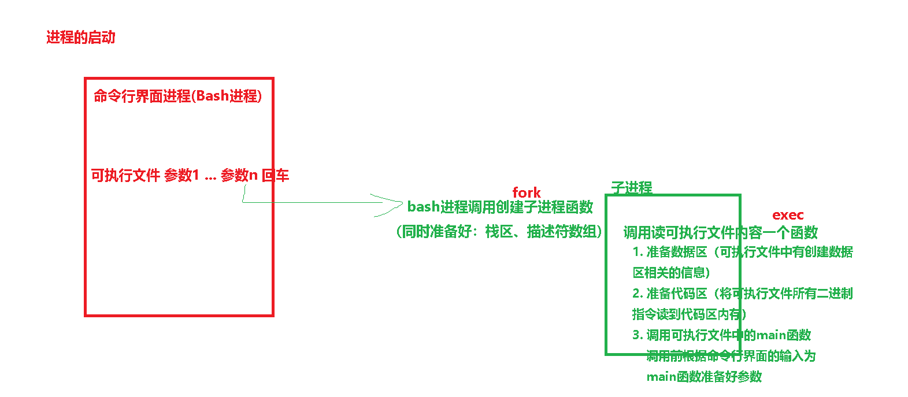
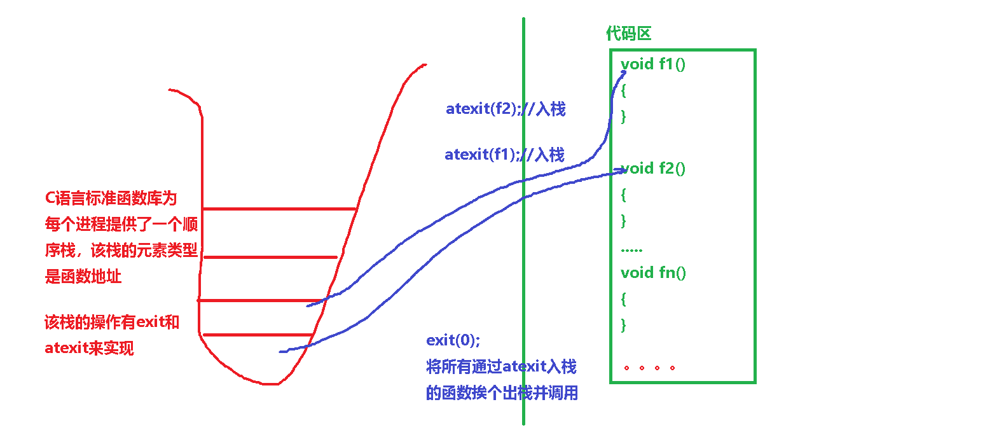
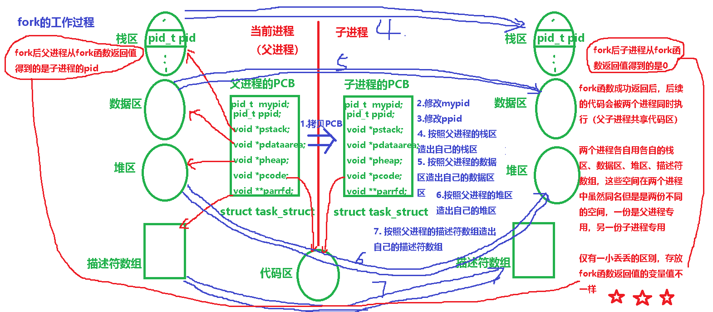
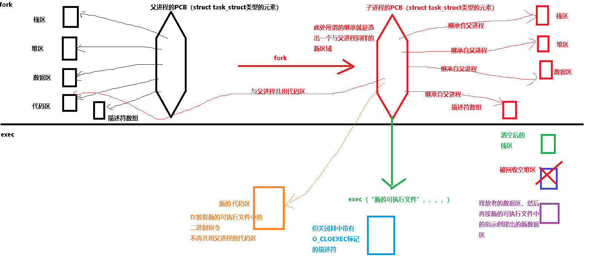
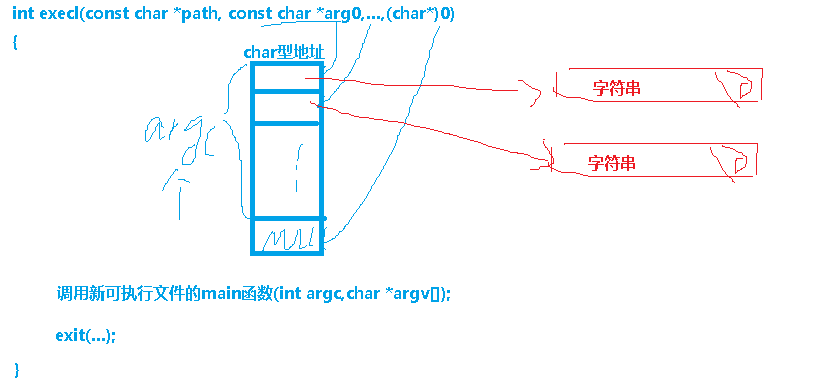

# 一、计算机系统层次结构

两层计算机系统层次：


四层计算机层次结构：


# 二、计算机工作原理

## 2.1 计算机的实际组成：

​							人体器官

cpu ：                    大脑  ------ 左脑子部件的计算功能

电源：                   心脏

内存：                   大脑  -------- 海马体子部件  临时记忆

主板：                  骨架


硬盘：                   大脑  ------   大脑内部皮层  永久记忆


## 2.2 工作原理：


## 2.3 内存的作用

计算机最核心的部件有两个：CPU   和  内存

内存的作用：用来存放**程序运行过程中**用到的**指令**和**数据**

# 三、操作系统（OS）的由来

程序分类：

1. 裸机程序：直接运行在硬件上的程序
2. 应用程序：只能运行在对应操作系统上的程序

操作系统：一个用来给应用程序提供运行环境的裸机程序

操作系统通过提供系统调用函数来为应用程序提供运行环境，应用程序开发过程直接或间接调用到这些函数


操作系统发展史：无系统 -----> 批处理系统------->多道系统 --------->多任务系统


操作系统管理的核心实体是任务，其次是内存，一般一个操作系统分为如下模块：

1. 任务管理：提供多任务并行执行的支持以及任务间通信机制
2. 内存管理：为了避免多个并行执行的任务间使用内存出错导致相互干扰，需要多内存的使用进行合理规划
3. 设备管理：为了让应用程序开发人员直接接触硬件原理，需要将各种设备的使用封装成简单调用的函数以减轻应用程序开发的负担
4. 网络管理：提供各种互联网协议栈的支持，将网络通讯封装成简单调用的函数
5. 文件管理：提供各种文件系统的支持，将对文件和目录的访问封装成简单调用的函数
6. 启动管理：初始化各种硬件、软件资源，为以上模块的代码做好准备工作


多任务并行执行:

1. 单个CPU通过分时机制（时间片轮转）实现多任务支持（实际是利用人类对时间刻度的感受精度不够，让人感觉是同时，实际一个时刻只能执行一个任务的代码，伪并行）
2. 多核CPU可以支持真正的并行执行
3. 但实际系统中并行执行的任务数太多，因此多核CPU系统中都会采用真并行和伪并行的混合机制来实现多任务并发执行
4. 不管是真并行还是伪并行，在后续知识的理解上我们都认为是并发执行


# 四、系统调用


有很多系统调用函数完成其指定功能需要满足一定条件，而有时该条件却未能满足，此时这些调用函数可能会采用两种不同形式处理：

1. 阻塞：条件满足则直接完成功能返回，条件不满足则等到指定的条件的满足，然后去完成它的功能并返回
2. 非阻塞：条件满足则直接完成功能返回，条件不满足则立即返回错误

# 五、任务（Task）

执行流：指有开始、有结束、总体顺序执行的、一段代码

执行流有两种：

1. 任务流：参与CPU时间片轮转的正常功能代码
   	1. 进程
    	2. 线程
2. 异常流：专门用来处理一些突发情况的代码

程序：广义词，可包含源码文件、可执行文件、正在执行的程序，但大部分情况指源码文件和可执行文件等未被执行的程序

任务：专指正在执行的程序

分类：

1. 进程：Process
2. 线程：Thread

区分进程和线程：

1. 线程不能独立存在，它只能隶属于创建它的进程

   因此：1>在具有多线程的进程中，进程实际是线程的容器

   ​            2>只能先创建好进程，然后才能在进程中创建线程            

2. 进程是操作系统分配资源的基本单位：

   a. 每个进程都有自己的内存四区（进程的内存布局）和描述符数组

   b. 而线程只有自己独立栈区，其它三区和描述符共用它所隶属的进程

3. 线程是参加时间片轮转的最小单位：

   a. 进程和线程都会参与时间片轮转

   b. 线程是轻量级任务，进程是重量级任务

五状态

​	

两种正常状态：

1. 就绪态：正在等待时间片的任务所处的状态（位于就绪队列中任务所处的状态）

 	2. 执行态：从就绪队列中出队使用CPU时间片的状态（CPU正在执行其指令的状态）

三种特殊状态：

1. 暂停态：由于外部因素的干扰导致任务暂时停止运行的状态（与任务本身的逻辑无任何关联性）

 	2. 僵死态：任务所有指令都已被执行完，但该任务所占有的资源还未被系统回收的状态
 	3. 睡眠态：由于某些条件不成立导致任务需要等待其成立，在等待的这段时间任务所处的状态（与任务逻辑密切相关）


# 六、进程管理

Linux操作系统用struct   task_struct类型表示一个任务，不管是进程还是线程都用这种类型来表示，操作系统中将结构体称为PCB----进程控制块。

在用PCB表示进程和线程时，对其成员的赋值不太一样。

操作系统中采用多种数据结构管理并发执行的多个进程，其中一种数据结构是树，该树被称为进程树

每个进程有一个唯一身份标识------pid    （process id）,linux中pid是一个整型数

pid_t getpid()  （重点）

pid_t getppid()   （重点）

pid为0的进程可以看作是Linux系统内核本身

pid为1的进程被称为祖先进程，后续进程都是它的子孙

# 七、程序与进程

一个可执行文件至少对应一个进程，也可以通过调用操作系统提供的专门函数来创建多个子进程

进程查看：

​	ps：（重点）

1. ps查看当前控制台启动的进程
2. ps  -ef 查看父子进程
3. ps -aux查看进程状态和占有资源

​	top：

​	pstree ：树形显示

​	/proc/pid_t目录对应一个进程


进程运行方式：

1. 前台执行：前台执行的进程会霸占标准输入（键盘），用户的键盘输入只能被前台进程读取

   ​                  前台进程的终止：Ctrl+C                  

2. 后台执行：`带路径的可执行文件   &`   后台执行的进程不能读取用户的键盘输入

   ​                   后台进程的终止：kill   进程号 

# 八、进程的启动

C程序总是从main函数开始执行：int main(int argc, char * argv[]);
要启动程序的父进程（命令行界面这个程序或者是桌面或者资源管理器）调用fork+exec时内核会调用一个启动例程（exec函数在内核中的实现）
这个启动例程作为新程序的起始地址
这个启动例程准备好命令行参数和环境变量表，然后调用main


老式main函数原型： int main(int argc, char *argv[], char * envp[]);
现代的方案使用全局变量 extern char **environ;
环境变量的内容由”name=value”形式的字符串组成
通常使用getenv和putenv函数来操作环境变量，而不直接使用全局变量




# 九、进程的终止

所谓进程的终止就是指该进程的代码不会再被执行，进程先进入僵死态，被其父进程善后处理后永远消亡

有8种方式使进程终止

1. 5种正常终止
   从main函数返回（return） （最推荐）
   调用exit （C库函数）（不是很推荐）
   调用_exit （系统调用）（不推荐）
   最后一个线程从其启动例程返回
   最后一个线程调用pthread_exit
2. 3种异常终止
   调用abort(C库函数)（禁止）
   接到一个信号并终止
   最后一个线程对取消请求作出响应

exit : void  exit(int status)  //status形参作用等同于main函数的返回值

_exit: void _exit(int status)

abort： void  abort(void)


atexit

void exit(int status)

{

​	//1. 销毁文件流缓冲区（FILE类型的对象），如果输出缓冲区有未被保存的内容，会将其保存到外存

​	//2. 调用atexit注册的函数

​	_exit(status);

}



# 十、进程的创建

`pid_t  fork(void);`
功能：通过复制当前进程创建一个新的子进程
返回值：子进程中返回0，父进程中返回子进程PID，出错返回< 0
注：

1. 创建的新进程被称为子进程
2. 将子进程的pid返回给父进程的理由：一个进程可以有多个子进程，没有一个函数可以获得所有子进程的pid。
3. 子进程返回值为零的理由： 一个进程只会有一个父进程，子进程可以调用getppid获得其父进程的pid，调用getpid获取自己的pid
4. 实际就是复制父进程的PCB，然后修改子进程PCB中的某些项
5. fork之后，父进程和子进程之间的执行顺序不确定，谁先执行谁后执行是根据系统运行现状来决定的



示例代码：

```c
int glob = 6; char buf[]=“a write to stdout\n”;
int main(int argc, char *argv[])
{
	int  var=88;  pid_t  pid;
	write(STDOUT_FILENO, buf,sizeof(buf)-1);
	printf(“before fork\n”);
	pid = fork();
	if(pid < 0) {  perror(“fork error”);
	}
	else if(0 == pid){  //child
		glob++; var++;
	}
	else { //parent
		sleep(2);
	}
	printf(“pid = %d, glob = %d, var = %d\n”,getpid(), glob, var);
	return 0;
}
```

输出分析：

```shell
$./testfork
a write to stdout
before fork
pid=430,glob=7,var=89               子进程的变量值改变了
pid=429,glob=6,var=88               父进程的变量值没有改变

$./testfork >./temp.txt
$cat ./temp.txt
a write to stdout
before fork
pid=430,glob=7,var=89              
before fork                                   why？？？
pid=429,glob=6,var=88

#终端作为标准输出设备时，连接的物理设备，采用行缓冲的，由换行符冲洗
#普通文件作为标准输出设备时，连接的是文件，采用全缓冲的
#每个进程终止时，最终会冲洗其缓冲区的副本

#一个问题：如何让子进程不执行if结构后续代码？

```

fork函数技术分析：

1. 子进程和父进程继续执行fork后的代码（没有调用exit或main没有return）

2. 子进程是父进程的副本，子进程获得父进程数据区、堆和栈的副本，而共享代码区

3. 父进程中所有打开的文件描述符都被复制到子进程中。

4. 父子进程中的每个相同的文件描述符共享一个文件操作引擎，这种共享的方式使得这两个文件描述符使用同一个文件位置指示器

   

5. fork常见的两种用法：
   a. 一个父进程希望复制自己，使父子执行不同的代码段。网络编程中经常用来处理服务请求

   b. 一个进程要执行一个不同的程序，即子进程执行exec

   

   另一个vfork函数:`pid_t  vfork(void);`

   1）父进程和子进程共享一份地址空间

   2）vfork保证子进程先运行，在它调用exec或exit函数之后父进程才会被调度运行

   3)   因为子进程和父进程共用一份地址空间，而且子进程先执行，所以子进程会修改父进程中的变量值

补充讲解：文件描述符的本质------每个进程都有一个用于存放文件操作引擎地址的数组，描述符其实就是这个数组的下标

# 十一、进程的善后

一个已经终止、但其父进程尚未对其进行善后的子进程称为“僵尸进程”，此时该子进程处于僵死状态（zombie）

子进程的善后处理是由其父进程进行的，这些善后包括获取已终止子进程的有关信息 和 释放子进程仍占用的资源

僵死前，子进程会向其父进程发送SIGCHILD信号

```
pid_t  wait(int *statloc); ------ 重点
功能：如果有子进程成为僵尸，则对子进程进行善后后返回此子进程的pid，否则函数阻塞到有僵尸子进程为止，通俗地讲就是等待子进程终止。
参数：
	statloc： 保存子进程终止时一些信息，不关心时置NULL
注：
一般情况下如果没有僵尸子进程，则阻塞
有僵尸子进程出现，则父进程对其进行善后，并获取子进程的终止状态信息后立即返回
如果没有任何子进程，则立即出错返回 <0
```


```
pid_t  waitpid(pid_t  pid, int *statloc, int  options);
pid参数详解：
     -1 等待任一子进程，这方面等效于wait
     >0 等待其PID与pid相等的子进程
     0 等待同组的任一子进程
     < -1 等待其组ID等于pid绝对值的任一子进程

options：
     0 等效于wait
     WNOHANG  waitpid不阻塞立即返回，成为一个实时获取子进程状态函数，此时函数返回值可判断是否为僵尸进程，为0表示无僵尸进程
     其它：不太常用

```


考虑一下这种情况：父进程已经终止，子进程仍就运行中，此时子进程的父进程应该由谁来担当？
进程的父进程已经消亡，在没有被其它进程“领养”前的进程叫孤儿进程。
孤儿进程最后都由进程号为1的init进程领养


另一种避免僵尸进程的方法：

```c
.....
pid_t pid;
pid_t gpid;

pid = fork();
if(pid < 0)
{
    return 1;
}
if(pid == 0)
{//son-process
    gpid = fork();
    if(gpid < 0)
    {
        exit(1);
    }
    if(gpid == 0)
    {//grandson-process
       //doing something  
    }
    exit(0);
}
else
{//parent-process
    wait(NULL);
}
....
```


避免僵尸进程的三种方法：

1. 父进程自己调用wait或waitpid对退出的子进程做善后
2. 让祖先进程做（见上面的示例代码）
3. 让系统做（ 父进程fork前调用signal(SIGCHLD,SIG_IGN）)


课堂练习：编写一个程序，该程序创建一个子进程，子进程负责向文件test.txt文件中写字符串“Hello world”，子进程退出后父进程读出test.txt文件内容并打印到命令行界面


# 十二、进程的替换





```
可变参数类：
int execl(const char *path, const char *arg0,…,(char*)0); -----重点
int execlp(const char *file, const char *arg0,…,(char*)0); ----- 重点
int execle(const char *path, const char *arg0,…,(char*)0,char * const envp[]);
固定参数类
int execv(const char *path, char * const argv[]);
int execvp(const char *file, char * const argv[]);
int execve(const char *path, char * const argv[], char * const envp[]);

功能：替换掉当前进程，即用一个全新的程序替换当前进程存储区，对当前进程做些清理工作后，重置PCB许多项。
p表示通过搜索PATH环境变量指定的路径查找可执行文件
e表示把环境变量表同时传给新进程

调用示例：
char * const ps_argv[] ={“ps”,”-ax”,NULL};
char * const ps_envp[] ={“PATH=/bin:/usr/bin”, “TERM=console”,NULL};

execl(“/bin/ps”,”ps”,”-ax”,NULL);
execlp(“ps”, ”ps”,”-ax”,NULL );
execle(”/bin/ps”,”ps”, ”-ax”,NULL , ps_envp);

execv(“/bin/ps”,ps_argv);
execvp(“ps”,ps_argv);
execve(“/bin/ps”,ps_argv, ps_envp);

```

**exec后四区的变化：栈区被清空，数据区重新分配，堆区中原来分配统统被释放回收，代码区被独立创建**

**exec后文件描述符是否关闭：所有open时带O_CLOEXEC标记的描述符会被关闭，不带此标记会被保留**

# 十三、C库函数system

```c
int system(const char *cmdstring);
/*
功能：运行以cmdstring参数传递给它的命令，并等待该命令的完成
返回值：正常返回执行命令的进程的终止状态
*/

int my_system(const char *cmdstring)
{
    pid_t pid;
    int exitstatus = 0;
    
    pid = fork();
    if(0 == pid)
    {
        //解析字符串cmdstring 得到可执行文件名以及各个选项
       	execlp(可执行文件名,可执行文件名,选项1字符串,....,选项n字符串,NULL);
    }
    else
    {
        wait(&exitstatus);
    }
    
   	return exitstatus;
}

#include <stdlib.h>
#include <stdio.h>
int main(int argc, char *argv[])
{
	printf(“Running ps with system\n”);
	system(“ps -ax”);
	printf(“Done.\n”);
	return 0;
}
```

# 十四、守护进程（精灵进程）daemon

守护进程也称为精灵进程（daemon），是一种生存期较长的进程，其特征：

1. 守护进程没有控制终端
2. 无法在屏幕上打印信息也无法接收键盘输入
3. 后台运行
4. 常常在系统自举时启动，在系统关闭时才终止
5. 进程组的组长进程以及会话的首进程，也是唯一进程
6. 大多数守护进程的父进程是init进程
7. 守护进程一般都是以超级用户身份特权运行


```c
#include <stdio.h>
#include <stdlib.h>
#include <syslog.h>
#include <fcntl.h>
#include <sys/types.h>
#include <sys/stat.h>
#include <sys/resource.h>
#include <unistd.h>
#include <signal.h>

void daemonize(const char *cmd)
{
    int                 i, fd0, fd1, fd2;
    pid_t               pid;
    struct rlimit       rl;
    struct sigaction    sa;
    /*
     * Clear file creation mask.
     */
    umask(0);

    /*
     * Get maximum number of file descriptors.
     */
    if (getrlimit(RLIMIT_NOFILE, &rl) < 0)
        printf("%s: can't get file limit", cmd);

    /*
     * Become a session leader to lose controlling TTY.
     */
    if ((pid = fork()) < 0)
        printf("%s: can't fork", cmd);
    else if (pid != 0) /* parent */
        exit(0);
    setsid();

    /*
     * Ensure future opens won't allocate controlling TTYs.
     * 通过再次创建子进程结束当前进程，使进程不再是会话首进程来禁止进程重新打开控制终端
     */
    sa.sa_handler = SIG_IGN;
    sigemptyset(&sa.sa_mask);
    sa.sa_flags = 0;
    if (sigaction(SIGHUP, &sa, NULL) < 0)
        printf("can't ignore SIGHUP");
    if ((pid = fork()) < 0)
        printf("%s: can't fork", cmd);
    else if (pid != 0) /* parent */
        exit(0);

    /*
     * Change the current working directory to the root so
     * we won't prevent file systems from being unmounted.
     */
    if (chdir("/") < 0)
        printf("can't change directory to /");

    /*
     * Close all open file descriptors.
     */
    if (rl.rlim_max == RLIM_INFINITY)
        rl.rlim_max = 1024;
    for (i = 0; i < rl.rlim_max; i++)
        close(i);

    /*
     * Attach file descriptors 0, 1, and 2 to /dev/null.
     */
    fd0 = open("/dev/null", O_RDWR);
    fd1 = dup(0);
    fd2 = dup(0);

    /*
     * Initialize the log file.
     */
    openlog(cmd, LOG_CONS, LOG_DAEMON);
    if (fd0 != 0 || fd1 != 1 || fd2 != 2) {
        syslog(LOG_ERR, "unexpected file descriptors %d %d %d",
          fd0, fd1, fd2);
        exit(1);
    }
}

int main(int argc, char * argv[])
{
    daemonize(argv[0]);
    pause();
    return 0;
}

```


几个概念：

一、进程组

每个进程除了有一个父进程之外，还属于一个进程组
进程组是一个或多个进程的集合
每个组有个唯一的进程组ID
pid_t getpgrp(void);
通常与同一作业相关联（cat xxx | grep yyy为一个作业）
可以接收来自同一终端的各种信号
每个进程组都可以有一个组长进程
组长进程的pid等于组ID
**int setpgid(pid_t pid,pid_t pgid);**可以用来设置自己和其子进程的组ID或创建一个新的进程组

二、会话session

会话是一个或多个进程组的集合
pid_t setsid(void);  建立新会话
调用进程成为新会话的会话首进程（session leader）
调用进程成为一个新进程组的组长进程

三、控制终端

一个会话可以有一个控制终端
具有控制终端的会话其首进程此时叫控制进程
一个会话的几个进程组可以分为一个前台进程组和多个后台进程组
按键（如ctrl+c中断和ctrl+\退出）产生的信号将发送给前台进程组中的所有进程


复习内容：

C语言的核心是------函数

程序中函数定义来源：

1. 自定义函数
2. 别人定义的函数
   1. C库函数
   2. 系统调用
   3. 第三方函数

C语言学习过程中既要会自定义函数，也要会用C库中常用的函数，见如下：

stdio.h

printf   sprintf  fprintf

scanf   sscanf  fscanf

fopen  fclose

fread  fwrite

fgetc  fputc

fgets fputs

fseek   ftell


string.h:

strlen

strcpy strncpy

strcat strncat

strcmp strncmp strcasecmp strncasecmp

strchr   strstr

memset  memcpy  memmove  memcmp  


strlib.h:

malloc  free

rand  srand


math.h:

sqrt  pow  .....


学习调用别人提供的函数，要搞清楚：

1. 函数的主要功能和附加功能
2. 搞清楚每个形参的作用，尤其是指针类型的形参（数组类型作为形参也是当作指针类型）
3. 然后获取处理后结果（函数返回值、指针类型的形参）


将指针类型的形参分为三种：

1. 值参数 ：该形参指向空间在该函数调用过程不会被修改（该函数只读该形参指向空间的内容）
2. 结果参数：该函数只向该形参指向空间中填写处理结果
3. 值-结果参数：该函数既要读该形参指向空间的内容又会修改其指向空间的内容


```
void func1(int arr[])  ------>   void  func1(int *arr)

void func2(int arr[][3]) ------>  void func2(int (*arr)[3])

void func3(int* arr[]) ---------> void func3(int **arr)

void func4(int arr[][3][4][5][4]) ------>  void func2(int (*arr)[3][4][5][4])

void func5(int ** arr[])   ------> void func5(int ***arr)


N维数组都可以看作是一维数组，这个数组的元素是"N-1维的数组"

数组名在表达式单独出现（无下标操作、不是取地址、不是sizeof）时代表下标为0的元素的地址值

数组类型作为函数形参类型时，完全等价于指向元素的一级指针


```

