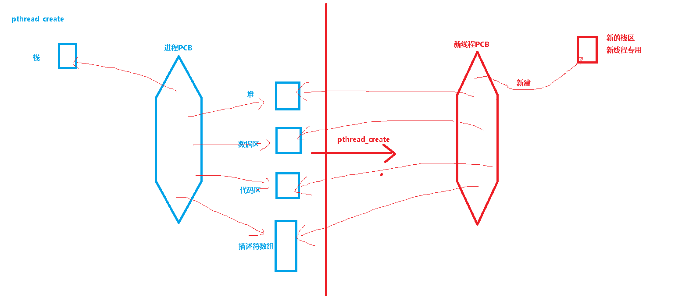
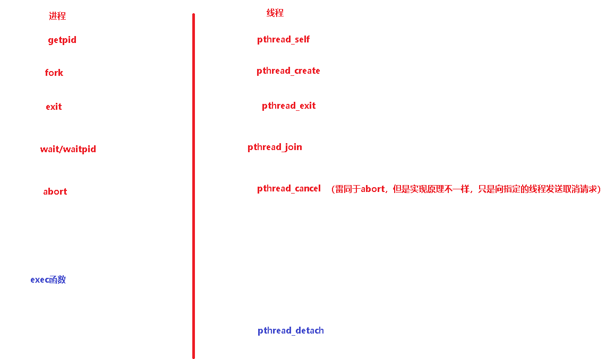

# 一、线程


1. 线程隶属于创建它的进程，是进程中某个单一顺序的执行流 
2. 线程是CPU调度的最小任务，同一进程中的多个线程之间是并发执行的
3. 一个进程中的所有线程都可以访问该进程的组成部件，如文件描述符、代码区和一切可得到地址值并未被回收的内存
4. 在一个进程中包括多个线程，每个线程都是作为利用CPU的基本单位，是花费最小开销的实体 
5. 线程自己不拥有系统资源，只拥有一点在运行中必不可少的资源，但它可与同属一个进程的其它线程共享进程所拥有的全部资源
6. 线程有各自的调用栈（call stack），自己的寄存器环境（register context），自己的线程本地存储（thread-local storage，__thread关键字）


线程优势：

创建和终止线程的代价较小

线程间切换运行花销较少

高效率的相互通信方式

简化处理异步事件


ps -efL

ps -f -L -p pid

# 二、主线程

一个没有创建任何线程的进程，其本身就是一个任务

一旦一个进程创建了线程，其本身成为了一个线程的容器，而main函数所在的执行序列成为的主线程

因此，一个创建了N个线程的进程中，实际包含N+1个线程，多出来的哪个1就是main函数所在的主线程


# 三、线程标识

每个进程都有自己独一无二的PID，这个PID是由系统统一管理分配

和进程一样每个线程也有自己的ID，但它只在属主进程中唯一

pthread_t数据类型表示线程ID，在Linux中是个无符号长整，但是其它系统中可能是个结构指针

所有线程函数的声明在pthread.h中，均以pthread_开头

int pthread_equal(pthread_t  tid1,  pthread_t   tid2);相等非零，不等为零

pthread_t  pthread_self(void); 获取调用线程的线程ID


# 四、线程的创建

`int pthread_create(pthread_t  * pTid,  const pthread_attr_t  * pAttr, void *(*thread_start)(void *), void * arg);`
功能：创建以thread_start为入口函数的新线程
返回值：成功返回0，失败返回错误编号
参数：pTid：保存新线程的ID
               pAttr：指定新线程的属性，见后续小节
               thread_start：新线程代码的入口地址
               arg：传递给新线程入口函数的实际参数 

-D_REENTRANT
-lpthread



# 五、线程的终止

单个线程可以通过下列三种方式在不终止整个进程的情况下退出：

1. 线程只是从其入口函数正常返回，返回值是线程的退出码
2. 线程调用pthread_exit
3. 线程可以被同一进程中的其他线程取消

void pthread_exit(void * pRVal);
功能：终止调用线程
参数：pRVal：记录线程退出码，可由pthread_join函数访问该值指向内容

```
了解：
void pthread_cleanup_push(void (*rtn) (void *), void * arg);
void pthread_cleanup_pop(int execute);
push注册一个清理函数
pop删除一个清理函数
execute参数为0，不调用清理函数
三种情况清理函数被调用：
1. 调用pthead_exit时
2. 响应取消请求时
3. 用非0参数调用pthread_cleanup_pop时
```

int pthread_cancel(pthread_t tid);
功能：向指定线程发送取消请求
返回值：成功为0，失败错误码
指定线程响不响应取消请求，如何响应处理请求由线程属性决定


# 六、线程善后

int pthread_join(pthread_t thread, void ** ppRVal);
功能：等待指定线程退出，并通过ppRVal获取退出线程的退出码
返回值：成功为0，失败返回错误编号
参数：thread：等待其退出的线程ID
           ppRVal：获取线程的退出码,如果不感兴趣可置为NULL

线程正常返回时：ppRVal被赋值成入口函数的返回值
线程调用pthread_exit退出时被赋值成该函数的形参
线程被取消时被赋值成PTHREAD_CANCELED

pthread_join会对退出线程做些善后处理，类似于waitpid
该函数没法对分离的线程操作。如何分离线程见后续章节


# 七、线程分类1：按是否能由pthread_join函数善后

线程分类1：

1. 可联结线程
2. 分离线程

使已有线程分离：(重点)
int pthread_detach(pthread_t tid);  成功0，失败错误码


线程让自己成为分离的线程：pthread_detach(pthread_self());


# 八、线程属性（了解）

pthread_attr_t
int pthread_attr_init(pthread_attr_t  * pAttr);
int pthread_attr_destroy(pthread_attr_t  * pAttr);
功能：同函数名
参数：
pAttr：指向表示线程属性的结构指针
返回值：成功0，失败错误码


使用范例：

```c
pthread_attr_t thread_attr;
pthread_attr_init(&thread_attr);

//修改某些属性
ret = pthread_create(&tid,&thread_attr,entry_func,arg);


pthread_attr_destroy(&thread_attr);

```


在创建线程时，指定新线程为分离的：
`int pthread_attr_getdetachstate(const pthread_attr_t *pAttr, int * detachstate);`
`int pthread_attr_setdetachstate(pthread_attr_t * pAttr, int  detachstate);`
功能：同函数名
返回值：成功0，失败错误码
参数：
pAttr：线程属性结构指针
detachstate：
            PTHREAD_CREATE_DETACHED 或 PTHREAD_CREATE_JOINABLE


# 九、线程分类2：按是否响应取消请求  (了解)

1. 可取消线程
2. 不可取消线程

int pthread_setcancelstate(int state, int * oldstate);  返回0或错误码
 参数： state：新状态 
            oldstate：获取老状态
 参数取值可能：PTHREAD_CANCEL_ENABLE 或 PTHREAD_CANCEL_DISABLE

线程默认为： PTHREAD_CANCEL_ENABLE 

当线程为PTHREAD_CANCEL_DISABLE时，cancel请求成为未决状态，直到线程再次成为PTHREAD_CANCEL_ENABLE时处理取消请求


可取消线程对取消请求的响应：

1. pthread_cancel调用并不等待对应线程终止，也不是立即杀死线程

2. 线程在默认情况下，收到取消请求会继续运行直到到达某个取消点
   取消点：线程检查是否被取消并按照请求进行动作的一个位置
   man pthreads
   
3. 在线程很长一段时间都不会调用取消点函数时，可以自己添加取消点：
        void pthread_testcancel(void);
        前提是线程处于： PTHREAD_CANCEL_ENABLE
    
4. 响应取消请求的方式：延迟取消（默认方式）和异步取消
   int pthread_setcanceltype(int type, int * oldtype);
   type取值：     
   
   ​        PTHREAD_CANCEL_DEFERRED 或PTHREAD_CANCEL_ASYNCHRONOUS
   所谓异步取消：线程可以在任意时间取消，不用检查取消点，但也不是立即取消，我们不知道它在何时被取消，因此很少使用


课堂练习：编写程序完成如下功能，主线程打开一个文件后创建一个线程，新线程向文件写“hello world”，主线程等新线程退出后从文件中读出内容并显示

