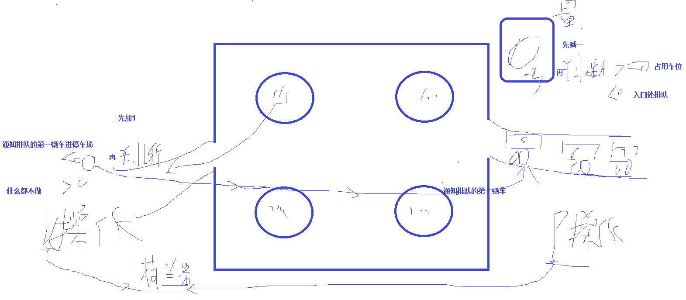
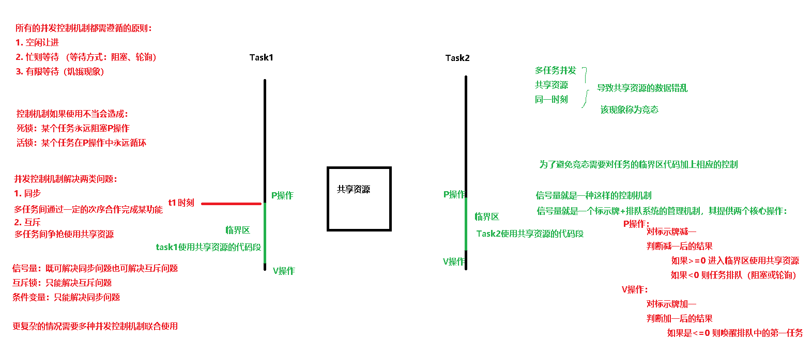
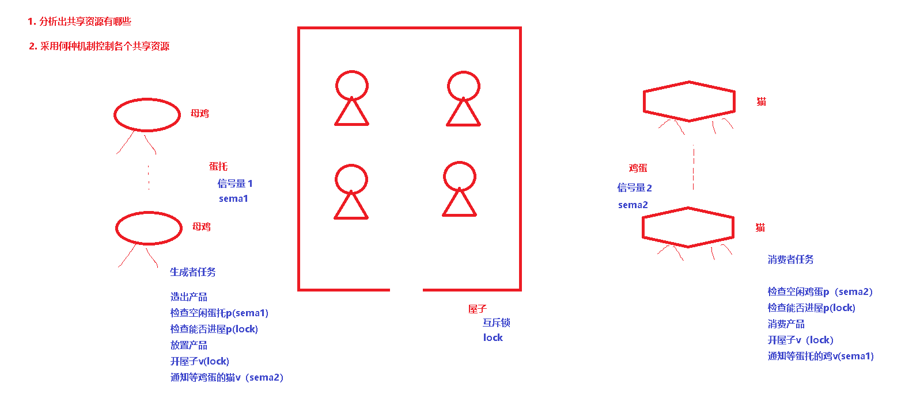
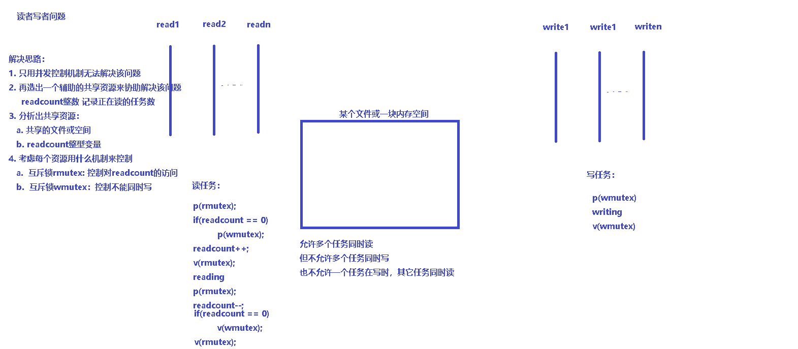
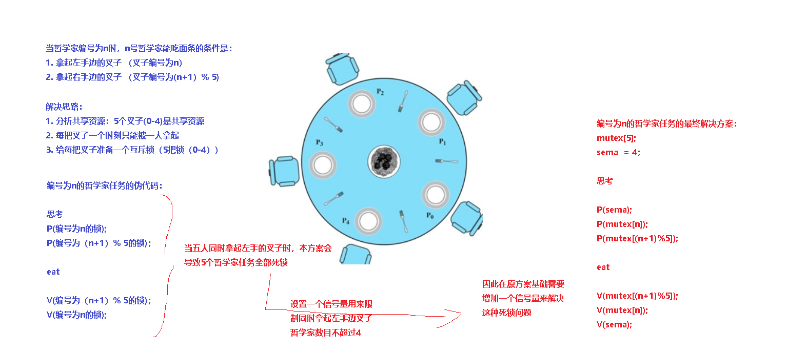

# 一、几个问题

1. 如果两台电脑同时向同一台打印机送出打印内容，打印内容是各自期望的吗？如何解决？
2. 客车上只有20个座位，A队有30人从前门上车，B队有30人从后门上车，问座位排满时，A队多少人？B队多少人？
3. 一条生产线上，两个相邻工位，前一个工位工作没完成时，后一个工位处于什么状态？
4. 两个进程打开同一个文件，同时对文件进行操作，会出现什么问题？

# 二、并发与竞态

## 2.1 并发执行：Concurrent

1. 多个单元同时、并行被执行
2. 这样单元可能是进程或线程
3. 并发执行单元对共享资源的访问很容易导致数据错乱
4. 解决这样的错乱问题是所有操作系统核心问题之一

## 2.2 竞态情形：Race Condition

1. 从多任务的角度来讲，是指两个或多个任务对共享的数据进行读或写的操作时，最终的结果取决于这些任务的执行顺序
2. 并发产生竞态，竞态导致共享数据的错乱
3. 一种极端低可能性的事件，因此程序员往往会忽视竞态。但是在计算机世界中，百万分之一的事件可能没几秒就会发生，而其结果是灾难性的。
4. 竞态是由于对资源的共享访问而产生的

解决竞态的方法：

1. 只要可能，就应该避免资源的共享。若没有共享访问，就不会有竞态。
2. 必须显式地控制对共享资源的访问。常见控制技术有：锁定、互斥、原子操作，确保一次只有一个任务使用共享资源。


# 三、同步与互斥

## 3.1 同步

任务之间直接的制约关系，是为完成某种功能而建立的两个或多个任务，这个任务需要在某些位置上协调他们的工作次序而等待、传递信息所产生的制约关系。

任务间是合作关系，而不是竞争关系，存在着依赖。

工厂生产线

比如说进程A需要从缓冲区读取进程B产生的信息，当缓冲区为空时，进程A因为读取不到信息而被阻塞。而当进程B产生信息放入缓冲区时，进程A才会被唤醒。


## 3.2 互斥

任务之间的间接制约关系。当一个任务使用共享资源时，另一个任务必须等待。只有当其余任务不在使用共享资源后，这个任务才会解除阻塞状态。

任务间竞争关系，而不是合作关系，存在着争抢。

汽车座位

比如进程B需要访问打印机，但此时进程A占有了打印机，进程B会被阻塞，直到进程A释放了打印机资源,进程B才可以继续执行。


# 四、临界区

共享资源，又被称为临界资源，可以是一些物理设备如打印机、硬盘上的文件、内存块被多个任务所共享的资源

任务内访问临界资源的代码被成为临界区。

显式处理临界资源的一般步骤：

1. 进入区:查看临界区是否可访问，如果可以访问，则转到步骤二，否则任务会被阻塞直到临界区可访问。
2. 临界区：在临界区操作共享资源。
3. 退出区:清除临界区被占用的标志。
4. 剩余区：进程与临界区不相关部分的代码


# 五、解决竞态问题的机制--------并发控制机制

并发控制机制：

同步机制：解决同步问题

互斥机制：解决互斥问题


应遵循的原则：
空闲让进
忙则等待
有限等待：避免死等（死锁（活锁）、饥饿）

等待方式：
让权等待：让出处理器，睡眠
忙等待：轮询等待


饥饿现象

指一个可运行的进程尽管能继续执行，但被调度器无限期地忽视，而不能被调度执行的情况。

现象描述：如果任务T1封锁了数据R,任务T2又请求封锁R，于是T2等待。T3也请求封锁R，当T1释放了R上的封锁后，系统首先批准了T3的请求，T2仍然等待。然后T4又请求封锁R，当T3释放了R上的封锁之后，系统又批准了T4的请求......T2可能永远等待

有一定几率解开

解决方法：先来先服务 ---- 排队


5.1 信号量





5.2 互斥锁-----二元信号量


死锁现象 （睡眠式死等）

每一个任务都在等待只能由其他任务才能引发的事件，那么这些是死锁的
对临界资源操作不当，导致任务永远睡眠
有时又称为抱死
现实例子：交通死锁
如果任务A锁住了资源1并等待资源2，而任务B锁住了资源2并等待资源1，这样两个任务就发生了死锁现象
如果某个任务在其临界区代码里试图再次获取同样的共享资源
如果任务A锁住了资源，临界区后没有释放锁，任务B永远没法获得共享资源，则任务B死锁，任务A在其后续代码里又试图获取共享资源，则任务A死锁


活锁：轮询式死等




# 六、典型问题分析

## 6.1 生成者消费者问题-----有限缓冲问题





有一群生产者任务在生产产品，并将这些产品提供给消费者任务去消费。

为使生产者任务与消费者任务能并发执行，在两者之间设置了一个具有 n 个缓冲区的缓冲池

生产者任务将它所生产的产品放入一个缓冲区中；消费者任务可从一个缓冲区中取走产品去消费。

不允许消费者任务到一个空缓冲区去取产品，也不允许生产者任务向一个已装满产品且尚未被取走的缓冲区中投放产品


## 6.2 读者写者问题

一个数据文件或记录或内存空间，可被多个任务共享， 我们把只要求读该文件的任务称为 “Reader任务” ，其他任务则称为 “Writer 进程” 。

允许多个任务同时读一个共享对象，因为读操作不会使数据文件混乱。

但不允许一个 Writer 任务 和 其他 Reader 任务或 Writer 任务同时访问共享对象，因为这种访问将会引起混乱。



```
readcount：正在读数据的任务数  0
wmutex：负责写互斥 1
rmutex：读者进程间互斥访问readcount 1

//读进程
wait(rmutex);
if(0==readcount) 
{
	wait(wmutex);
}
readcount++;
up(rmutex);
reading;
wait(rmutex);
readcount--;
if(0==readcount)  up(wmutex);
up(rmutex);

//写进程
wait(wmutex);
writing;
up(wmutex);
```


## 6.3 哲学家就餐问题


初步解决方案：
mutex chopstick[5] 全部初始化为1则：
wait(chopstick[i]);
wait(chopstick[(i+1)%5]);
eat();
signal(chopstick[i]);
signal(chopstick[(i+1)%5]);
think();

死锁？




