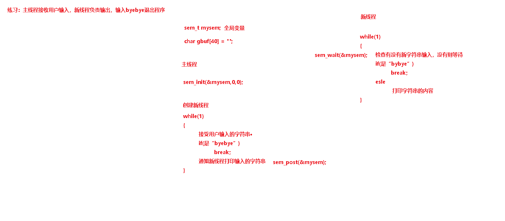
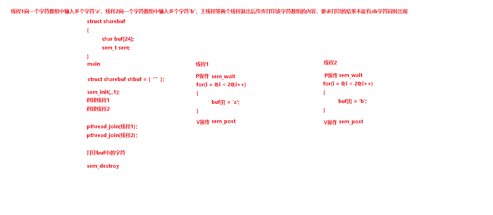
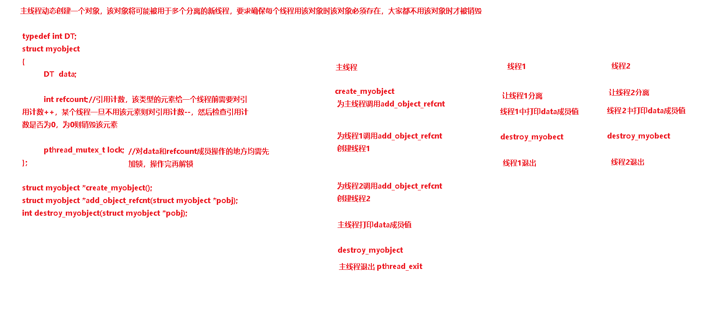

一个进程的多线程间通信很容易，只要借助一块内存空间，该空间可以是：

1. 全局变量空间或者是某函数体内static局部变量的空间

2. 动态分配的堆空间

3. 未返回的某函数栈空间

   

但是该内存空间能被多线程间共享必须满足如下基本原则：

1. 任何线程使用该空间时，一定要确保该空间仍然在其生存期内（即确保该空间未被回收）
2. 为了避免竞态，需要合理使用相应的并发控制机制

# 一、线程信号量 

可解决同步问题也可解决互斥问题

```c
头文件：#include <semaphore.h>
类型：sem_t
初始化：int sem_init(sem_t *sem, int pshared, unsigned int value);
清理：int sem_destroy(sem_t *sem);
P操作： int sem_wait(sem_t *sem);
V操作： int sem_post(sem_t *sem);

功能：见函数名
返回值：成功为0，失败<0
注：pshared参数填零，本来是期望可以实现进程间使用的，Linux未实现
```

练习1：主线程接收用户输入，新线程负责输出，输入byebye退出程序（先全局变量后结构体）

printstring——local.c




练习2：线程1向一个字符数组中输入多个字符'a'，线程2向一个字符数组中输入多个字符'b'，主线程等两个线程退出后负责打印该字符数组的内容，要求打印的结果不能有ab字符同时出现



# 二、线程互斥锁 ------ 互斥问题

```c
头文件：#include <pthread.h>
类型：pthread_mutex_t
PTHREAD_MUTEX_INITIALIZER 初始化
初始化：int pthread_mutex_init(pthread_mutex_t * mutex, NULL);
清理：int pthread_mutex_destroy(pthread_mutex_t * mutex);
阻塞P操作： int pthread_mutex_lock(pthread_mutex_t * mutex);
非阻塞P操作： int pthread_mutex_trylock(pthread_mutex_t * mutex);
V操作： int pthread_mutex_unlock(pthread_mutex_t * mutex);

功能：见函数名
返回值：成功0，失败错误码
```

练习1：主线程动态创建一个对象，该对象将可能被用于多个分离的新线程，要求确保每个线程用该对象时该对象必须存在，大家都不用该对象时才被销毁



# 三、线程读写锁 ----- 读者写者问题

```c
头文件：#include <pthread.h>
类型：pthread_rwlock_t
初始化：int pthread_rwlock_init(pthread_rwlock_t * rwlock, NULL);
清理：int pthread_rwlock_destroy(pthread_ rwlock _t * rwlock);
阻塞读锁P操作： int pthread_rwlock_rdlock(pthread_ rwlock _t * rwlock);
阻塞写锁P操作： int pthread_rwlock_wrlock(pthread_ rwlock _t * rwlock);
非阻塞读锁P操作： 
     int pthread_rwlock_tryrdlock(pthread_ rwlock _t *rwlock);
非阻塞写锁P操作： 
     int pthread_rwlock_trywrlock(pthread_ rwlock _t *rwlock);
V操作： int pthread_rwlock_unlock(pthread_ rwlock _t * rwlock);

功能：见函数名
返回值：成功0，失败错误码
    
模板代码：
创建读写锁，
初始化读写锁pthread_rwlock_init
    
所有对共享资源做的读操作：
pthread_rwlock_rdlock
读共享资源
pthread_rwlock_unlock
    
    
所有对共享资源做的写操作：    
pthread_rwlock_wrlock
写共享资源
pthread_rwlock_unlock
    
    
销毁读写锁pthread_rwlock_destroy
```

练习：主线程创建并插入链表节点，新线程查找节点，找到则删除该节点


# 四、线程条件变量-------同步问题

```c
头文件：#include <pthread.h>
类型：pthread_cond_t
PTHREAD_COND_INITIALIZER 初始化
初始化：int pthread_cond_init(pthread_cond_t * cond, NULL);
清理：int pthread_cond_destroy(pthread_cond_t * cond);
P操作： 
     int pthread_cond_wait(pthread_cond_t * cond, pthread_mutex_t *mutex);
V操作： int pthread_cond_signal(pthread_cond_t * cond);
V操作: int pthread_cond_broadcast(pthread_cond_t * cond);

功能：见函数名
返回值：成功0，失败错误码
mutex为已经处于锁状态的互斥锁，因此条件变量必须与一个互斥量配合使用
```

练习：主线程产生任务，新线程处理任务


```
代码模板：
pthread_cond_t cond;
pthread_mutex_t lock;

程序开始时：
pthread_mutex_init(&lock,NULL);
pthread_cond_init(&cond，NULL);

程序结束前：
pthread_mutex_destroy(&lock);
pthread_cond_destroy(&cond);

A线程为先做线程
pthread_mutex_lock(&lock);
....
pthread_mutex_unlock(&lock);
pthread_cond_signal(&cond);


B线程为后做线程
pthread_mutex_lock(&lock);
if(条件表达式为假)
{
	pthread_cond_wait(&cond,&lock);
}
.....
pthread_mutex_unlock(&lock);
```


作业：线程1向一个字符数组中输入字符'a'，线程2向一个字符数组中输入字符'b'，主线程等待两个线程退出后负责打印该字符数组的内容，要求打印的结果是：“abababababababababab”或“babababababababababa”


# 五、线程池

如果一个应用需要频繁的创建和销毁线程，而任务执行的时间又非常短，这样线程创建和销毁的带来的开销就不容忽视，这时也是线程池该出场的机会了。如果线程创建和销毁时间相比任务执行时间可以忽略不计，则没有必要使用线程池了

参考实现代码：

```c
 #include <stdio.h>
 #include <stdlib.h>
 #include <unistd.h>
 #include <sys/types.h>
 #include <pthread.h>
 #include <assert.h>
 /*
 *线程池里所有运行和等待的任务都是一个CThread_worker
 *由于所有任务都在链表里，所以是一个链表结构
 */
 typedef struct worker
 {
        /*回调函数，任务运行时会调用此函数，注意也可声明成其它形式*/
        void *(*process) (void *arg);
        void *arg;/*回调函数的参数*/
        struct worker *next;
 } CThread_worker;

/*线程池结构*/
  typedef struct
 {
        pthread_mutex_t queue_lock;
        pthread_cond_t queue_ready;
      
        /*链表结构，线程池中所有等待任务*/
        CThread_worker *queue_head;
        /*当前等待队列的任务数目*/
        int cur_queue_size;
      
        /*是否销毁线程池*/
        int shutdown;
      
        pthread_t *threadid;
        /*线程池中允许的活动线程数目*/
        int max_thread_num;
        
 } CThread_pool;

 int pool_add_worker (void *(*process) (void *arg), void *arg);
 void *thread_routine (void *arg);

 
 CThread_pool * pool_init (int max_thread_num)
 {
     	CThread_pool *pool = NULL;
        pool = (CThread_pool *) malloc (sizeof (CThread_pool));
        
     	pthread_mutex_init (&(pool->queue_lock), NULL);
        
     	pthread_cond_init (&(pool->queue_ready), NULL);
        
     	pool->queue_head = NULL;        
        pool->cur_queue_size = 0;
     
     	pool->shutdown = 0;
     
     	pool->max_thread_num = max_thread_num;        
        pool->threadid = (pthread_t *) malloc (max_thread_num * sizeof (pthread_t));
        int i = 0;
        for (i = 0; i < max_thread_num; i++)
        {
            pthread_create (&(pool->threadid[i]), NULL, thread_routine,
                    pool);
        }
     
     	return pool;
 }

 /*向线程池中加入任务*/
 int pool_add_worker (void *(*process) (void *arg), void *arg)
 {
        /*构造一个新任务*/
        CThread_worker *newworker = (CThread_worker *) malloc (sizeof (CThread_worker));
        newworker->process = process;
        newworker->arg = arg;
        newworker->next = NULL;/*别忘置空*/
       
        pthread_mutex_lock (&(pool->queue_lock));
        /*将任务加入到等待队列中*/
        CThread_worker *member = pool->queue_head;
        if (member != NULL)
        {
            while (member->next != NULL)
                member = member->next;
            member->next = newworker;
        }
        else
        {
            pool->queue_head = newworker;
        }
        assert(pool->queue_head != NULL);
        pool->cur_queue_size++;
        pthread_mutex_unlock (&(pool->queue_lock));
        /*好了，等待队列中有任务了，唤醒一个等待线程；
        注意如果所有线程都在忙碌，这句没有任何作用*/
        pthread_cond_signal (&(pool->queue_ready));
        return 0;
 }

 /*销毁线程池，等待队列中的任务不会再被执行，但是正在运行的线程会一直
    把任务运行完后再退出*/
 int pool_destroy (CThread_pool *pool)
 {
     	pthread_mutex_lock (&(pool->queue_lock));
        if (pool->shutdown)
        {
            pthread_mutex_unlock (&(pool->queue_lock));
            return -1;/*防止两次调用*/
        }
        pool->shutdown = 1;
     	pthread_mutex_unlock (&(pool->queue_lock));
        /*唤醒所有等待线程，线程池要销毁了*/
        pthread_cond_broadcast (&(pool->queue_ready));
        /*阻塞等待线程退出，否则就成僵尸了*/
        int i;
        for (i = 0; i < pool->max_thread_num; i++)
            pthread_join (pool->threadid[i], NULL);
        free (pool->threadid);
        /*销毁等待队列*/
        CThread_worker *head = NULL;
        while (pool->queue_head != NULL)
        {
            head = pool->queue_head;
            pool->queue_head = pool->queue_head->next;
            free (head);
        }
        /*条件变量和互斥量也别忘了销毁*/
        pthread_mutex_destroy(&(pool->queue_lock));
        pthread_cond_destroy(&(pool->queue_ready));
        
        free (pool);
        /*销毁后指针置空是个好习惯*/
        pool=NULL;
        return 0;
 }

 void *thread_routine (void *arg)
 {
     CThread_pool *pool = (CThread_poll *)arg;
        printf ("starting thread 0x%x/n", pthread_self ());
        while (1)
        {
            pthread_mutex_lock (&(pool->queue_lock));
            /*如果等待队列为0并且不销毁线程池，则处于阻塞状态; 注意
            pthread_cond_wait是一个原子操作，等待前会解锁，唤醒后会加锁*/
            while (pool->cur_queue_size == 0 && !pool->shutdown)
            {
                printf ("thread 0x%x is waiting/n", pthread_self ());
                pthread_cond_wait (&(pool->queue_ready), &(pool->queue_lock));
            }
            /*线程池要销毁了*/
            if (pool->shutdown)
            {
                /*遇到break,continue,return等跳转语句，千万不要忘记先解锁*/
                pthread_mutex_unlock (&(pool->queue_lock));
                printf ("thread 0x%x will exit/n", pthread_self ());
                pthread_exit (NULL);
            }
            printf ("thread 0x%x is starting to work/n", pthread_self ());
            /*assert是调试的好帮手*/
            assert (pool->cur_queue_size != 0);
            assert (pool->queue_head != NULL);
            
            /*等待队列长度减去1，并取出链表中的头元素*/
            pool->cur_queue_size--;
            CThread_worker *worker = pool->queue_head;
            pool->queue_head = worker->next;
            pthread_mutex_unlock (&(pool->queue_lock));
            /*调用回调函数，执行任务*/
            (*(worker->process)) (worker->arg);
            free (worker);
            worker = NULL;
        }
        /*这一句应该是不可达的*/
        pthread_exit (NULL);
 }

 //下面是测试代码

 void * myprocess (void *arg)
 {
        printf ("threadid is 0x%x, working on task %d/n", pthread_self (),*(int *) arg);
        sleep (1);/*休息一秒，延长任务的执行时间*/
        return NULL;
 }
 int main (int argc, char **argv)
 {
        CThread_pool *pool = NULL;
        pool = pool_init (3);/*线程池中最多三个活动线程*/
        
        /*连续向池中投入10个任务*/
        int *workingnum = (int *) malloc (sizeof (int) * 10);
        int i;
        for (i = 0; i < 10; i++)
        {
            workingnum[i] = i;
            pool_add_worker (myprocess, &workingnum[i]);
        }
        /*等待所有任务完成*/
        sleep (5);
        /*销毁线程池*/
        pool_destroy (pool);
        free (workingnum);
        return 0;
 }
```

