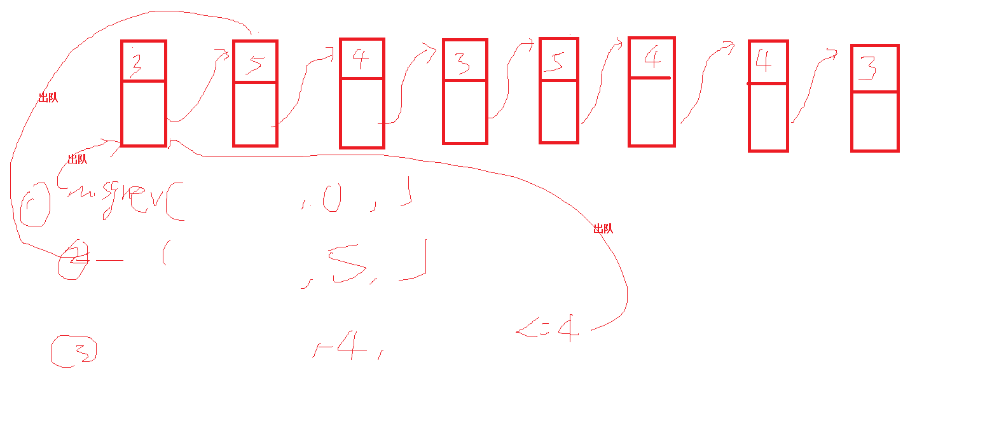

# 一、IPC简介

IPC：Inter-Process Communications
广义：不同进程间传递、共享信息或提供服务的方式
分类：

1. 同一主机进程间：狭义IPC
   消息传递类：信号、管道、消息队列、本地Socket
   共享存储类：文件共享、共享内存
   同步机制类：锁文件、区域锁、信号量
2. 不同主机进程间：
   TCP/IP类：Socket编程
   远程调用类：RPC，Linux没有现成支持，基于网络实现

每个进程都有各自的地址空间
进程间共享信息的方法： 见下图

1. 两个进程共享存储于文件系统中某个文件内容： 文件共享、锁文件
2. 两个进程共享驻留于内核中的某些信息： 管道、消息队列、信号量、本地Socket、区域锁
3. 两个进程有一个双方都能访问的共享内存区
4. 给进程发信号


IPC对象的持续性：（进程使用IPC对象时一定要确保IPC对象存在）

1. 随进程持续的：管道、区域锁、Socket
2. 随内核持续的：消息队列、信号量、共享内存
3. 随文件系统持续的：共享文件、锁文件


# 二、信号

生活中经商定作为采取一致行动的暗号
Unix家族操作系统中：是一种进程间通讯的有限制的方式
是一种异步的通知机制，用来提醒进程一个事件已经发生
信号只是用来通知某进程发生了什么事件，并不给该进程传递任何数据
当一个信号发送给一个进程，操作系统中断了进程正常的控制流程，此时，任何非原子操作都将被中断
如果进程定义了信号的处理函数，那么它将被执行，否则就执行默认的处理函数
一个进程可以给其它进程和自己发送信号,内核也可以给所有进程发送信号

理论上Linux支持64个信号，每一个信号对应一个编号（0~63）:（kill -l可查看所有支持的信号）

1. 0~31号信号为普通信号，其中序号为0的叫空信号，任何进程都无视空信号，普通信号处理前收到多次只记一次，因此是不可靠的
2. 32~63号信号为实时信号，实时信号处理前收到多次会被排队，因此是可靠的

进程PCB结构用整型表示64个信号，每一位对应一个信号，为了方便使用在signal.h为每个信号编号定义一个宏


进程对收到的信号处理方法：

1. 第一种是类似中断的处理程序，对于需要处理的信号，进程可以指定处理函数，由该函数来处 理。
2. 忽略某个信号，对该信号不做任何处理，就象未发生过一样，这也叫信号屏蔽，这由PCB的信号屏蔽成员控制
3. 对该信号的处理保留系统的默认值，这种缺省操作，对大部分的信 号的缺省操作是使得进程终止

常见信号1:收到这些信号的进程采取的默认动作是：异常终止进程

| SIGALRM 14 | 由alarm函数设置的定时器超时时产生                            |
| ---------- | ------------------------------------------------------------ |
| SIGHUP 1   | 终端断开连接时发送给控制进程或控制进程退出时发给每个前台进程 |
| SIGINT 2   | Ctrl+c组合键产生                                             |
| SIGKILL 9  | 不能被捕获或忽略，系统管理员一种杀死任何进程的可靠方法       |
| SIGPIPE 13 | 管道数据没有读进程时产生                                     |
| SIGTERM 15 | Kill命令发送的默认信号，要求进程结束运行                     |
| SIGUSR1 10 | 进程之间可以用来通信，含义进程之间自定义                     |
| SIGUSR2 12 | 进程之间可以用来通信，含义进程之间自定义                     |

常见信号2：收到这些信号的进程采取的默认动作是：除了异常终止进程，还会产生coredump文件

| SIGFPE 8   | 浮点运算异常时产生         |
| ---------- | -------------------------- |
| SIGILL 4   | 处理器执行了一条非法的指令 |
| SIGQUIT 3  | Ctrl+\组合键产生           |
| SIGSEGV 11 | 段冲突。内存非法操作时产生 |

常见信号3：收到这些信号的进程采取的默认动作是：进程挂起，进程暂停执行

| SIGSTOP 19 | 暂停执行进程，不能被捕获或忽略 |
| ---------- | ------------------------------ |
| SIGTSTP 20 | Ctrl+z组合键产生，导致终端挂起 |

常见信号4：收到这些信号的进程采取的默认动作是：忽略

| SIGCONT 18 | 如果进程被暂停，就继续执行，否则忽略 |
| ---------- | ------------------------------------ |
| SIGCHLD 17 | 进程暂停或退出时产生，发送给其父进程 |

发送信号：

1. 命令：

   给指定的进程发信号：
   kill -num pid
   kill –XXX pid   //XXX,不带SIG信号名称如KILL、 ALRM等等

   给所有可执行文件名叫指定名称的进程发信号
   killall -num 程序名
   killall –XXX  程序名

2. 函数：

   ```c
   功能：给指定的进程发信号
   原型：int kill(pid_t pid, int signo); ----重点
   返回值：成功返回0，否则< 0
   参数：
   	signo参数可以直接使用序号，或预定义好的常量宏如SIGINT（推荐）
   	pid > 0 表示接受信号的进程的PID
   	pid == 0 给同组（进程组）进程发送信号
   	pid < -1 给进程组ID等于pid绝对值的进程发送信号
   	pid == -1 发给本进程有权限给对方发信号的所有进程
   	
   给进程自身发信号
   int raise(int signo)  完全等价于kill(getpid(),signo)
   ```

   

安装信号处理函数：

```c
int sigaction(int signo, const struct sigaction *act, struct sigaction *oact);
返回值：成功返回0，否则< 0
参数：
	act：非空时修改对应信号处理动作
	oact：非空时保存对应信号的上一个动作

struct sigaction{
	void  (*sa_handler)(int); /*新的信号处理函数指针*/ 
		/*两个特殊值SIG_IGN忽略信号，SIG_DFL恢复默认行为*/
	sigset_t sa_mask;  /*新的进程信号屏蔽字*/
	int   sa_flags; /*一般填零*/
}

int sigaddset(sigset_t *set,int signo);/*向信号集里增加信号*/
int sigemptyset(sigset_t *set);/*清空信号集*/
int sigfillset(sigset_t *set); /*信号集里包含所有信号*/
int sigdelset(sigset_t *set,int signo); /*从信号集里删除信号*/
成功返回0，失败< 0

老版简易型：signal
typedef void (*sighandler_t)(int);
sighandler_t signal(int signum, sighandler_t handler); ----- 重点
signal函数
    作用1：站在应用程序的角度，注册一个信号处理函数
    作用2：忽略信号，设置信号默认处理 信号的安装和回复
    /*两个特殊值SIG_IGN忽略信号，SIG_DFL恢复默认行为*/
参数
--signal是一个带signum和handler两个参数的函数，准备捕捉或屏蔽的信号由参数signum给出，接收到指定信号时将要调用的函数有handler给出
--handler这个函数必须有一个int类型的参数（即接收到的信号代码），它本身的类型是void
--handler也可以是下面两个特殊值：① SIG_IGN 屏蔽该信号        ② SIG_DFL 恢复默认行为    

    
signal(SIGCHLD,SIG_IGN);//表示父进程不关心子进程的退出，子进程退出的善后处理由系统自动进行，也是解决僵尸进程的一种简易方案（重点）
```


浅度睡眠与信号：

```c
n=read(fd,buf,BUFFSIZE);
while(n < 0){
	if(errno == EINTR)	{ //EINTR错误表示由信号引起的错误
		n = read(fd,buf,BUFFSIZE);//重新启动read
	}
	else{
		break;
	}
}
if(n < 0){
	exit(1);
}
………
    
errno是系统为每个线程维护的一个全局变量，该变量用来保存对应线程最后一次调用系统函数发送的错误
1. 代码中如果用到该全局变量，需要包含头文件#include <errno.h>
2. perror 
   void perror(const char *s);
   功能：先打印s指向的字符串，然后再打印errno值对应的错误描述字符串
3. strerror
   char *strerror(int errnum);
   功能：返回编号为errnum的错误描述字符串的首地址 
```


其它信号相关函数：

```c
unsigned int alarm(unsigned int seconds);
seconds秒后给调用进程发SIGALRM

int pause(void);
挂起调用进程直到接收到信号

unsigned int sleep(unsigned int seconds);
挂起调用进程直到seconds秒后或期间收到信号

void abort(void);
C库函数，发送SIGABRT给调用进程，然后异常终止进程
```


# 三、匿名管道

一个单向数据流通道
只能用于具有亲缘关系的进程间

当管道中没有数据时，如果去读，则读操作会阻塞

当管道中数据已满时，如果继续写，则写操作会阻塞

管道中最大数据量为4K

```
int pipe(int fd[2]);
功能：返回两个文件描述符:fd[0]和f[1]。前者打开读，后者打开写
返回值：成功0，失败< 0
```

fork前：


fork后：


父子进程合理关闭对应描述符后：


双向传输方案：


# 四、有名管道（命名管道、FIFO）

单工通信
有一个文件名与之关联
允许无亲缘关系的进程间建立管道

建议每次往管道写的数据不要超过512字节

```c
int  mkfifo(const char *pathname,  mode_t mode);
创建新FIFO,隐含指定了O_CREATE和O_EXCL
   
打开已有FIFO使用open函数(要么O_RDONLY 要么O_WRONLY)
不能使用lseek
open时会阻塞等待对端open

/*
一般步骤：
先创建FIFO
打开FIFO，获取文件描述符
读或写数据
关闭文件描述符
删除FIFO
*/
```


通讯双方需要制定统一的数据收发方案，这样的方案称为通讯协议，一份通讯协议应包括：

1. 收发数据的种类
2. 每种数据如何区分、包括哪些成份
3. 收发数据的次序


按照通讯协议组织好的一种数据，被称为该协议的PDU（Protocol Data Unit 协议数据单元），该协议的PDU将被某种通信机制进行传递


变长结构体：

1. 最后一个成员是数组大小为1的数组（为了运用数组名在表达式中单独出现等价于下标为0元素的地址值这一特性）
2. 一般还会有一个成员直接或间接能计算出以该数组成员为首个元素的后续空间大小
3. 一般不会定义该结构体的变量，而只是运用该结构体的指针变量


练习：使用命名管道+变长结构体完成如下功能：客户端进程首先选择要服务端完成的功能，输入1表示读取指定文本文件内容，输入2表示获取指定文件长度，服务端反馈对应结果给客户端，由客户端显示相应结果


# 五、System-V IPC机制

Unix家族一大分支
Linux中的消息队列、信号量集合、共享内存机制源自System V UNIX，因此称这三种IPC为System V IPC


## 5.1 key_t

System V IPC使用key_t作为通信双方共同预知的名字
key_t通常是一个至少32位的整数，通常调用ftok产生，用此键值作为该通信机制的身份

```c
key_t ftok(const char * pathname,  int id);
功能：根据指定路径和IPC通道号产生IPC键
返回值：成功IPC键，失败<0
参数：pathname：路径名（一般是目录名）
               id：相同路径下的不同IPC通道

key_t组成：id低8位+stat.st_dev低12位+stat.st_ino低12位
有几率重复,一般用项目目录名，避免重复
```

## 5.2  IPC对象元信息

内核为每个IPC对象维护一个信息结构,用于描述IPC对象的元信息（类似于文件的元信息）
struct  ipc_perm
{
    uid_t   uid;  //属主ID，可修改
    gid_t   gid;
    uid_t   cuid; //创建者ID，不可修改
    gid_t   cgid;
    mode_t   mode; //见open函数mode参数，此处一般为0666，不讲可执行
    ulong_t   seq;//产生全系统范围内IPC标识符的序列号
    key_t       key;//IPC名字，即IPC键
}

## 5.3 IPC对象的创建和打开


打开对应通信机制时，键值可以是ftok产生，也可以是IPC_PRIVATE（键值为0）：

1. 非亲缘关系进程间用ftok产生的键值
2. 亲缘关系进程间可以用ftol产生的键值，也可以用IPC_PRIVATE(表示此机制仅用于亲缘进程家族私有)


## 5.4 IPC对象相关命令

ipcs  -q   ipcrm –q id或ipcrm msg id  查看删除消息队列
ipcs  -s    ipcrm –s id或ipcrm sem  id  查看、删除信号量
ipcs  -m  ipcrm –m id或ipcrm shm id  查看、删除共享内存

# 六、消息队列

全双工通道
使用消息队列标识符标识，不是文件描述符
消息队列信息结构：

```c
struct msgid_ds
{
   struct  ipc_perm msg_perm; //ipc对象信息
   struct  msg  *msgfirst; //队头指针
   strcut  msg  *msglast; //队尾指针
   msglen_t  msg_cbytes; //队列中当前字节数
   msgqnum_t  msg_qnum; //队列中消息数
   msglen_t  msg_qbytes; //队列中允许的最大字节数,系统默认800KBytes
   pid_t   msg_lspid; // 最后发消息的进程ID
   pid_t   msg_lrpid; //最后收消息的进程ID
   time_t  msg_stime,msg_rtime,msg_ctime; //最后发、收消息的时间和最后修改队列信息的时间
}
```


消息队列接口：

```c
int msgget(key_t  key,  int  oflag);
功能：创建一个消息队列或打开一个已经存在的消息队列
返回值：成功消息队列标识符，失败 < 0
参数：key：消息队列名称键（ftok的返回值或IPC_PRIVATE）
     oflag：读写权限组合与IPC_CREAT和IPC_EXCL的位或
               
int msgctl(int msgid,  int  cmd,   struct  msgid_ds *buff);
功能：对指定消息队列做些控制操作
返回值：成功0，失败 < 0
参数：msgid：消息队列标识符，指定一个打开的消息队列
     buff：消息队列信息描述结构指针
     cmd：
	        IPC_RMID：删除指定消息队列，buff参数无用
            IPC_SET：由buff指定消息队列信息结构的msg_qbytes成员和msg_perm成员的uid、gid、mode成员
	        IPC_STAT：通过buff获取指定消息队列的信息
    
int msgsnd(int msgid,  const void * ptr, size_t length, int flag);
功能：向指定消息队列放置一个消息
返回值：成功0，失败 < 0
参数：msgid：消息队列标识符，指定一个打开的消息队列
     ptr：一个结构指针，其第一个成员必须是long  mtype;
     length：实际消息数据的长度（不含消息类型），一般填:sizeof(自定义结构) – sizeof(long)
     flag：0或IPC_NOWAIT
         
ssize_t msgrcv(int msgid,  void * ptr, size_t length, long type, int flag);
功能：从指定消息队列取出一个指定消息
返回值：成功返回实际接收到数据字节数（不含类型），失败 < 0
参数：msgid，ptr，length，flag：同msgsnd
     type：
            0：队列中的第一消息
            >0：类型值为type的第一个消息
            <0：<=type绝对值的类型最小的第一消息
    
type参数示例：见下图
队列里已有消息：
     第一个：类型为100
     第二个：类型为200
     第三个：类型为300
```




建议自定义结构为：

```c
#define DATA_LEN_MAX  2048 
struct my_msg 
{
	long len;
    long type;
    char data[DATA_LEN_MAX];
};
然后再对消息的发送和接收做二次封装
```


# 七、共享内存

效率最高的IPC形式：一旦内存区映射到对应进程，数据传递不再经过内核
但通常需要配合以同步机制

使用共享内存标识符标识，不是文件描述符

共享内存信息结构：

```c

struct  shmid_ds
{
   struct  ipc_perm  shm_perm; //ipc对象信息
   size_t  shm_segsz; //共享内存区的大小，单位字节数
   pid_t   shm_lpid; // 最后操作内存区的进程ID
   pid_t   shm_cpid; //创建共享内存区的进程ID
   shmatt_t    shm_nattch;//当前附接数
   time_t  shm_atime,shm_dtime,shm_ctime; //最后附接、断接的时间和最后修改共享内存信息的时间
}

```

共享内存接口：

```c
int  shmget(key_t key, size_t size, int  oflag );
功能：创建一个新的共享内存区或者打开一个已存在的共享内存区
返回值：成功返回共享内存标识符，失败 < 0
参数：key：共享内存名称键（ftok的返回值或IPC_PRIVATE）
     size：以字节为单位的指定共享内存区的大小,创建时必须大于0，只打开时为0
     oflag：mode | [IPC_CREAT] | [IPC_EXCL]
创建时共享内存区被初始化为size个0

void * shmat(int  shmid, const void* shmaddr, int  flag );
功能：将指定共享内存附接到调用进程的地址空间 （调用进程获取共享内存的首地址）
返回值：成功返回映射区的起始地址，失败 < 0
参数：
     shmid：共享内存标识符
     shmaddr：为NULL起始地址系统决定，不为NULL则是一个建议起始地址
     flag：为0或SHM_RDONLY

int shmdt(const void* shmaddr );
功能：将指定的地址空间与共享内存断接 （调用进程不可以继续使用共享内存）
返回值：成功0，失败 < 0
只是断接，并不删除；进程退出会自动断接，但不可依赖，建议程序中显式调用

int shmctl(int shmid,  int  cmd,   struct  shmid_ds *buff);
功能：对指定共享内存做些控制操作
返回值：成功0，失败 < 0
参数：shmid：共享内存标识符，指定一个打开的共享内存
     buff：共享内存信息描述结构指针
     cmd：
	        IPC_RMID：删除指定共享内存，buff参数无用
            IPC_SET：由buff指定共享内存信息结构的msg_perm成员的uid、gid、mode子成员。
	        IPC_STAT：通过buff获取指定共享内存的信息
```


另一种用于具有亲缘关系进程间的共享内存机制：

```c
打开/dev/zero
该设备为0字节的无限资源，接收数据确又忽略这些数据
用mmap映射此设备文件描述符
mmap指定MAP_SHARED
共享内存长度为mmap第二个参数
一个未名存储区
映射成功后共享内存被初始化为0
实际长度为页的整数倍
一旦映射成功即可关闭文件描述符
```


# 八、信号量集合

一个信号量集同时管理着一个或多个信号量
其中每个信号量都是计数信号量
信号量集信息结构：

```c
struct  semid_ds
{
     struct ipc_perm  sem_perm;//ipc对象信息
     struct sem         *sem_base;//信号量数组首地址
     ushort              sem_nsems;//信号量总数
     time_t  sem_otime, sem_ctime;//最后semop时间，创建或IPC_SET的时间
};

struct sem
{
     ushort_t   semval;//信号量当前值
     pid_t        sempid;//最后成功semop，SETVAL，SETALL进程的pid
     ushort_t   semncnt;//等待信号值增长，即等待可利用资源出现的进程数
     ushort_t   semzcnt;//等待信号值减少到零的进程数      
};
```

信号量集合接口：

```c
int  semget(key_t key, int nsems, int  oflag );
功能：创建一个新的信号量集或者打开一个已存在的信号量集
返回值：成功返回信号量集标识符，失败 < 0
参数：key：信号量集名称键（ftok的返回值或IPC_PRIVATE）
     nsems：指定集合中的信号量数，为0时表示打开一个存在的信号量集
     oflag：mode | [IPC_CREAT] | [IPC_EXCL]
信号量集一旦创建成功我们无法改变其中包含的信号量数目
新的信号量集被创建其中包含的所有信号量均未初始化

int  semop(int   semid, struct  sembuf *opsptr,  size_t  nops);
功能：对指定信号量集中的一个或多个信号量进行PV操作
返回值：成功0，失败 < 0
参数：semid：信号量集标识符，表示被操作的信号量集
               opsptr：包含多个操作的数组首地址
               nops：表示opsptr数组包含的操作个数
struct sembuf
{
     short  sem_num;//表示该操作的信号量在信号量集中的下标
     short  sem_op;//表示做什么操作，详见下页
     short  sem_flg; //操作的补充属性（0，IPC_NOWAIT，SEM_UNDO）
};
sem_flg：三者取其一
	IPC_NOWAIT：执行P操作时获取不到资源立即返回错误而不阻塞
	SEM_UNDO：有些程序在终止时并没有释放占用的信号量，这样可能会造成另外的等待资源的进程永久睡眠，加上这个标志后，每个进程会对它所用的信号量做一个登记，方便进程退出时释放占用的信号量资源
	0：P操作阻塞，不做SEM_UNDO
sem_op：
	> 0：V操作，释放指定数量被占用的资源数,该值将加到对应信号量的值上去
    < 0：P操作，获取指定数量的资源,
              如能获取到则返回成功，否则要么阻塞要么返回错误（IPC_NOWAIT）
              该值将从对应信号量的值减去
              同时改变semncnt值
	0：  P操作，指等待信号量为0
         如果信号量值为0则返回成功
         否则要么阻塞要么返回错误（IPC_NOWAIT）
         同时改变semzcnt值


int  semctl(int   semid,  int  semnum,  int  cmd,…);
功能：对指定信号量集执行相应命令
返回值：成功视cmd而定，失败 < 0
参数：semid：信号量集标识符，表示被操作的信号量集
               semnum：对单个信号量执行命令时指定信号量的下标
               cmd：执行10种命令中的一个命令，详见下页
               …:可以没有如果有则是一个union  semun类型的参数
union semun （需要自己定义）
{
        int   val;//SETVAL时指定要设置的值
        struct  semid_ds *buf;//IPC_STAT和IPC_SET时配合获取或设置IPC对象信息
        unsigned short  *array; //GETALL和SETALL时配合获取或设置所有值
        struct seminfo *__buf;  /* buffer for IPC_INFO */
};


cmd：
IPC_STAT:通过buf获取指定信号量集的信息
IPC_SET:由buf指定信号量集信息结构的sem_perm成员的uid、gid、
                  mode子成员
IPC_RMID:删除指定信号量集
GETVAL: 函数返回指定信号量的semval值
SETVAL（重点）: 通过union semun中val成员设置指定信号量的semval值
                   单个信号量初始化
GETPID: 函数返回指定信号量的sempid值
GETNCNT:函数返回指定信号量的semncnt值
GETZCNT:函数返回指定信号量的semzcnt值
GETALL:取所有信号量的值到union semun中array数组中
SETALL:按union semun中array数组中的值设置所有信号量的值
                 对信号量集 中所有信号量一起初始化

```

直接使用信号量集合不是很方便，一般需要对其进行二次封装

```c
union semun 
{
        int val;                    /* value for SETVAL */
        struct semid_ds *buf;       /* buffer for IPC_STAT, IPC_SET */
        unsigned short int *array;  /* array for GETALL, SETALL */
        struct seminfo *__buf;      /* buffer for IPC_INFO */
};
int sem_id;
/* The function set_semvalue initializes the semaphore using the SETVAL command in a
 semctl call. We need to do this before we can use the semaphore. */

static int set_semvalue(void)
{
    union semun sem_union;

    sem_union.val = 1;
    if (semctl(sem_id, 0, SETVAL, sem_union) == -1) return(0);
    return(1);
}

/* The del_semvalue function has almost the same form, except the call to semctl uses
 the command IPC_RMID to remove the semaphore's ID. */

static void del_semvalue(void)
{
    union semun sem_union;
    
    if (semctl(sem_id, 0, IPC_RMID, sem_union) == -1)
        fprintf(stderr, "Failed to delete semaphore\n");
}

/* semaphore_p changes the semaphore by -1 (waiting). */

static int semaphore_p(void)
{
    struct sembuf sem_b;
    
    sem_b.sem_num = 0;
    sem_b.sem_op = -1; /* P() */
    sem_b.sem_flg = SEM_UNDO;
    if (semop(sem_id, &sem_b, 1) == -1) {
        fprintf(stderr, "semaphore_p failed\n");
        return(0);
    }
    return(1);
}

/* semaphore_v is similar except for setting the sem_op part of the sembuf structure to 1,
 so that the semaphore becomes available. */

static int semaphore_v(void)
{
    struct sembuf sem_b;
    
    sem_b.sem_num = 0;
    sem_b.sem_op = 1; /* V() */
    sem_b.sem_flg = SEM_UNDO;
    if (semop(sem_id, &sem_b, 1) == -1) {
        fprintf(stderr, "semaphore_v failed\n");
        return(0);
    }
    return(1);
}
```


课堂练习：进程1向一个共享字符数组中输入字符'a'，进程2向一个字符数组中输入字符'b'，进程3负责打印该字符数组的内容，要求打印的结果是：“abababababababababab”或“babababababababababa”


一种简易进程锁-----锁文件（用文件的存在与否作为判断是否已加锁的条件）

以“原子操作”创建一个锁文件
原子操作：无法被打断的操作
锁文件充当一个指示器的角色
open、O_CREAT&O_EXCL
open原子操作完成先判断文件是否存在，如何不存在则创建它
/tmp/LCK.name
EEXIST错误号
建议性锁非强制

# 九、socket ---- 见网络编程


补充讲解：core dump机制

core文件：事后调试用，主要内容为进程段错误时保存进程所用内存的内容

ulimit -a  查看系统对进程占用资源的限制

ulimit -c unlimited 设置core文件的大小


gdb命令：core-file core文件名  + bt


作业1：使用命名管道+变长结构体实现如下功能：客户端进程首先选择要让服务端进程协助完成的事务，输入1：表示登录，输入2：求圆形面积，输入3：求长方形面积，输入0：表示登出并退出程序，1、2、3功能均要求服务端能将结果反馈给客户端，由客户端显示最终结果。


作业2：进程1向一个共享字符数组中输入字符'a'，进程2向一个字符数组中输入字符'b'，进程3负责打印该字符数组的内容，要求打印的结果是：“abababababababababab”或“babababababababababa”