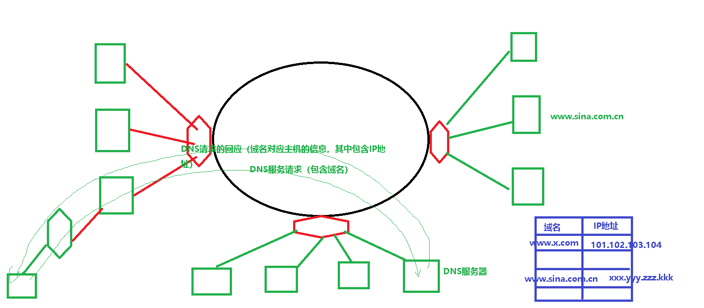

```c
int IPINTToIPString(unsigned int ip, char *ipstring)
{
    if(NULL == ipstring)
    {
        return -1;
    }
    sprintf(ipstring,"%d.%d.%d.%d",*((unsigned char *)&ip,
                                   *((unsigned char *)&ip + 1),
                                   *((unsigned char *)&ip + 2),
                                   *((unsigned char *)&ip + 3),);
    return 0;
}
```

原理性、练习式代码

```c
unsigned int IPStringToIPINT(char *ipstring)
{
	unsigned int ret = 0;
	
	sscanf(ipstring,"%d.%d.%d.%d",&ret,(unsigned char *)&ret + 1,(unsigned char *)&ret + 2,(unsigned char *)&ret + 3);

	return ret;
}
```

项目里:

```c
int IPStringToIPINT(char *ipstring,unsigned int *pret)
{
	unsigned char *puc = 0;
    int num1 = -1;
    int num2 = -1;
    int num3 = -1;
    int num4 = -1;
    
    if(NULL == ipstring  || NULL == pret)
    {
        printf("In IPStringToIPINT,input param is invalid!\n");
        return 1;
    }
	
	sscanf(ipstring,"%d.%d.%d.%d",&num1,&num2,&num3,&num4);
    
    if(num1 < 0 || num2 < 0 || num3 < 0 || num4 < 0 
       || num1 > 255 || num2 > 255 || num3 > 255 || num4 > 255)
    {
        printf("The string format is error\n");
        return 2;
    }
    
    puc = (unsigned char *)pret;
    
    *puc = num1;
    *(puc + 1) = num2;
    *(puc + 2) = num3;
    *(puc + 3) = num4;

	return 0;
}
```

100 = 技术50 + 第一印象20 + 口才20 +  运气10


IT： Information Technology  

IT行业就是研究获取、表示、存储、传输、处理、使用信息的行业

所谓信息就是对万事万物的抽象手段

抽象方法：计算机如果要处理某样事物，实际是通过运行程序去处理该样事物某些属性，而用数字来表示各种属性。

而数字在IT行业使用二进制来表示

因此，IT行业就是研究0和1的行业，就是对二进制位0、1进行存储、传输、处理、使用、获取、表示的行业


1100 1101 0111 1010

1. 表示几个数字，每个数字占几位

2. 每个数字的数值多大

   

3. 每个数字在具体问题中实际意义


内存中存储的是程序运行过程中用到的指令和数据，因此指令、数据在内存中均是以二进制位的形式存储的，

​			对于数据，我们用编程语言中的数据类型来说明如何用二进制位表示指定类型的数据

​                           unsigned short  16位 的无符号整数  

​							int   32位的有符号整数 （最高位当符号位用，其它位用补码形式表示数值大小）

​							float  32位的单精度浮点型 （IEEE 里相应的表示标准）

​         因此，所谓数据类型就是如何用二进制位表示指定类型数值的手段


硬盘中的各种文件都有所谓的文件大小，其单位是Byte字节，因此其实所有文件的文件内容都是二进制位串，而不同文件用文件格式来描述这些二进制位作用。


网络中描述传输速度的单位是bits/s 每秒传输多少位，因此网络中传输所有内容其本质都是传输二进制位串，而不同网络功能用不同的网络协议来描述这些二进制位串的作用


冯 偌伊曼：

1. 二进制思想：

   IT世界中的一切信息 = 二进制位 + 上下文（就是对二进制位作用的描述）

2. 程序存储：程序运行前需要将指令存放到内存，然后CPU从内存取值执行


​    


# 一、通信方式：(了解)

a. 电路交换（接线员人工接线------->程控交换自动接线）
b. 报文交换
c. 分组交换

# 二、网络编程（Socket编程）：

## 2.1 网络编程是进程间通信的延续

IPC：同一台电脑上同一系统里的两个进程间通信
网络：不同电脑上（操作系统也可能不一样）的两个进程间通信
          a. 如何区分不同的电脑（ip地址）
          b. 如何区分不同的电脑上的不同进程（端口号）

## 2.2 互联网与因特网

互联网（internet）：广义词，网网相联
因特网（Internet）：专有词，全球小老百姓使用的一个互联网

网络协议：每一种不同互联网都有其对应的一套协议
因特网上采用的协议：TCP/IP协议

网络协议（Protocol）主要制定如下内容：
a. 一共需要传输多少种数据包
b. 每个数据包中的二进制位含义（这样的数据包也被称为PDU：Protocol Data Unit）
c. 数据包的使用次序


因特网结构图：


## 2.3 ip地址 & 端口号 & MAC地址

ip地址：
         a. 点分十进制的字符串 "192.168.0.23"  4个数字取值范围 0~255
         b. 连续四字节的整型（编程所需的形式）
         c. 域名（"www.sina.com.cn"）
             服务名.机构名.用途名.地区名
             服务名：www(web服务、网页服务)、ftp、mailto
端口号：
         两个字节的整型（0～65535）
         0～1023：全球通用的一些服务 ------- 知名端口号
                         网页：80
                         文件服务：23
	 自定义的服务端口号：1024开始  ------- 动态端口号
MAC地址：(硬件地址 网卡地址)
         局域网范围以内如何区分不同网口（网卡）的方法
         a. 点分十六进制的字符串 "AB:56:F2:23:CD:32"  6个数字取值范围 0~255
         b. 连续六字节的整型（编程所需的形式）

## 2.4 因特网上采用的协议：TCP/IP协议栈或叫TCP/IP协议簇


称为TCP/IP协议族意味着包含很多个协议
称为TCP/IP协议栈意味着是分层的。（上一层调用下一层的功能而下一层给上一层提供功能）
**TCP/IP五层协议模型：(必背)**
a. 应用层:对应网络服务数据（http ftp SMTP POP3 IMAP4 DNS....）
b. 传输层:进程间的传输(TCP UDP)
c. 网络层:路由器间的传输(IP)
d. 链路层:局域网范围内网口到网口的传输
e. 物理层:用哪种传输介质以及这种传输介质如何表示二进制位

## 2.5 客户端 & 服务器

​		客户端：享受服务的进程

​      服务器：提供服务的进程

## 2.6 网络字节序 ------- 大端

字节序：指整型数在内存中的存放次序


两种：

1. little-endian：小端字节序 低端字节序   数字的低位放在低地址
2. big-endian：大端字节序 高端字节序     数字的高位放在低地址


uint32_t htonl(uint32_t hostlong)

uint16_t htons(uint16_t hostshort)

uint16_t ntohs(uint16_t hostshort)

uint32_t ntohl(uint32_t hostlong)


## 2.7 IP地址转换函数：

IP地址：本质上是四字节整型

表示法

1. 四字节整型 ----- 编程接口需要的表示形式
2. 点分十进制字符串 ----- “192.168.1.126”    每个十进制数的取值范围0~255
3. 域名  ------ www.baidu.com

1. inet_aton  inet_ntoa

   `int inet_aton(const char *cp,struct in_addr *inp)`

   `char * inet_ntoa(struct in_addr in)`

   ```
   struct in_addr
   {
   	unsigned long int s_addr; //IP地址 32位IPV4地址 网络字节序
   }
   
   ```

   inet_ntoa返回的是每个调用线程专用数据区空间的地址，因此：

   1. 不需要对其做free操作
   2. 本线程内，后一次调用会将前一次调用产生的结果覆盖
   3. 线程安全函数

2. gethostbyname

   `struct hostent *gethostbyname(const char *name)`

域名（Domain Name）的组成：

​	"服务名.组织名或公司.组织或公司性质.组织或公司所在的地区"

www.sina.com.cn

www：万维网  web服务 网页服务     ftp：文件服务   mailto：电子邮件  。。。。。

sina:公司名

com：商业性质   org：开源、非营业性   edu: 教育  。。。。 

cn: 中国大陆  .tw  ......

域名解析过程



简单示例：

```c
struct hostent *pret = NULL;
char **ppname = NULL;

pret = gethostbyname("www.sina.com");
if(NULL == pret)
{
    printf("gethostbyname failed\n");
    ..
}

ppname = pret->h_aliases;
while(*ppname != NULL)
{
    printf("aliasesname is %s\n",*ppname);
    ppname++;
}

//完整示例见testgethostbyname.c
```


## 2.8 后续学习：

a. 应用层数据的组织（应用层采用什么协议？是现成的还是自定义？）
b. 传输层的功能如何去用（TCP特点和使用方法 UDP特点和使用方法）

```
   TCP: Transfer Control Protocol（重中之重） 
            面向连接的、可靠的、有序的、流式传输、不支持多播和广播
            面向连接：意味着使用TCP进行传输前，需要通信双方建立好连接。
                            连接建立的过程如下：（三次握手）
                            1)客户端发送连接请求
                            2)服务器针对这个请求给一个对应的回应
                            3)客户端再回给服务器一个回应的回应
            可靠：确保双发传输的数据能到达对方
            流式传输：如果不全收，剩余的可继续接收                     
```

​            

​            

```
UDP: User Data Protocol
        面向非连接、不可靠的、无序的、数据报式传输、不支持多播和广播
        面向非连接：意味着使用UDP进行传输前，通信双方不需建立好连接。
        不可靠的：发送方只负责将数据发出去，确无法明确对方是否收到。
        报式传输：接收方要么全收，不全收剩余部分被丢弃
```

​      


 网络编程也被称为socket编程

socket:  插头 插排 插孔这些统称叫socket
能够发送和接收数据的Socket,必须具备:
a. 本端的地址（即本端的ip地址 + 端口号）
b. 远端的地址（即远端的ip地址 + 端口号）


地址结构体：

1. 因特网专用的socket地址结构

```c
struct  sockaddr_in
{
	short int                  sin_family;//AF_INET
    unsigned short int  sin_port;//端口号 网络字节序
    struct in_addr          sin_addr;//IP地址 32位IPV4地址 网络字节序
};
```

	2.接口函数通用的socket地址结构

```c
struct  sockaddr
{
	short int   sin_family;//协议族
    char        sa_data[14];//协议指定地址
};
```


# 2.9 TCP传输


### 2.9.1 客户端编码：

代码模板：

```c
int sockfd = -1;
struct sockaddr_in servaddr;
int ret = 0;

sockfd = socket(AF_INET,SOCK_STREAM,0);

bzero(&servaddr,sizeof(servaddr));//memset(&servaddr,0,sizeof(servaddr));
servaddr.sin_family = AF_INET;
servaddr.sin_port = htons(???);//???表示服务器的端口号
inet_aton(???,&servaddr.sin_addr);//???服务器的点分十进制字符串式的ip地址

ret = connect(sockfd,(struct sockaddr *)&servaddr,sizeof(servaddr));
if(ret)
{
    printf("connet server failed\n");
    .....//出错处理
}

。。。。。//收发数据
    
close(sockfd);//不再该网络通讯时应及时关闭描述符
sockfd = -1;
```


```c
int socket(int domain,int type,int protocol);
函数功能：创建一个用于网络通讯用的操控器，返回代表该操控器的描述符
参数：
    int domain ：表示该网络属于哪种互联网，如果Internet，该参数填：AF_INET
    int type：表示传输方式，流式传输填SOCK_STREAM,数据报式传输填SOCK_DGRAM,
	int protocol：表示传输协议，默认填0，即协议有前两个参数决定一个默认协议，
        也可以填IPPROTO_TCP、IPPROTO_SCTP之一
        填0时，默认的流式传输协议是TCP，默认的报式传输协议是UDP
返回值：返回代表该操控器的描述符
        

int connect(int sockfd,const struct sockaddr *addr,socklen_t addrlen);
函数功能：TCP时，通过三路握手与服务器建立好连接，为后续的可靠性数据传输做好准备,connect函数同时会为客户端填写自己的IP地址和端口号
参数：
    int sockfd：socket描述符
    const struct sockaddr *addr：其指向空间的内容为服务器的socket地址
    socklen_t addrlen：服务器socket地址所占内存空间的大小，socklen_t是无符号整型的别名
返回值：成功为0，失败-1，errno记录错误号
        
int close(int sockfd)
函数功能：关闭socket描述符，对于TCP同时会将连接断开，断开连接通过四路握手完成
        
收数据：
ssize_t read(int fd,void *buf,size_t count) 
ssize_t recv(int sockfd,void *buf,size_t count,int flags)
参数：
    int flags：默认填0，也可以填MSG_DONTWAIT表示本次接收为非阻塞
备注:
1. size_t是无符号整型的别名，ssize_t是有符号整型的别名
2. 对于TCP而言，如果返回值为0表示对方已关闭通讯描述符
   
发数据：
ssize_t write(int fd,const void *buf,size_t count) 
ssize_t send(int sockfd,const void *buf,size_t count,int flags)
 
```


三路握手建立连接：


四路握手断开连接：


### 2.9.2 服务器编码：

daemon - process 守护进程 精灵进程

```c
int servfd = -1;
int datafd = -1;
struct sockaddr_in servaddr;
int ret = 0;

servfd = socket(AF_INET,SOCK_STREAM,0);//默认情况下，socket函数创建是主动套接字（插头）

bzero(&servaddr,sizeof(servaddr));
servaddr.sin_family = AF_INET;
servaddr.sin_port = htons(???);//???表示服务器自身的端口号
inet_aton(???,&servaddr.sin_addr);//???表示服务器自身的点分十进制字符串式的IP地址

ret = bind(servfd,(struct sockaddr *)&servaddr,sizeof(servaddr));
ret += listen(servfd,?);//?一般填写1~20间的经验值，变主动套接字为被动套接字（插排）
if(ret)
{
    printf("bind or listen failed\n");
    ....//出错处理
}

while(1)
{
    datafd = accept(servfd,NULL,NULL);
    .....//用datafd与对应客户端进行数据收发处理
    close(datafd);//一旦与对应客户端不再进行数据交互，应及时关闭数据收发用描述符
    datafd = -1;
}


close(servfd);
servfd = -1;
```


```c
int bind(int sockfd, struct sockaddr *sockaddr,socklen_t addrlen)
功能：给指定的socket描述填写自己的socket地址（IP地址+端口号）
参数返回值同connect函数
    
int listen(int servfd, int backlog)
功能：变主动socket为被动socket，同时决定处理连接请求用的未完成队列的最大长度
参数：
    int servfd：将用于处理连接请求用的socket
    int backlog：为处理连接请求用的未完成队列的最大长度
返回值：成功为0，失败-1，错误号记录在errno中
备注：该函数不会引起阻塞
    
int accept(int servfd,struct sockaddr *addr,socklen_t *addrlen)
功能：监控已完成的连接请求队列，如果该队列为空则accept函数阻塞，如果该队列不空则accept函数返回与对应客户端进行数据交互用的socket描述符
参数：
    int servfd：服务端处理连接请求用的描述符（插排）
    struct sockaddr *addr：结果参数，通过该参数可以获知本次accept返回对应的那个客户端的socket地址 （网络字节序）
	socklen_t *addrlen：值-结果参数，告诉accept函数参数addr指向空间的大小，又可能会被改变成实际客户端地址所占空间的大小
返回值：正常返回与对应客户端进行数据交互用socket描述符，错误返回-1，错误号记录在errno中
```


课堂练习：客户端接收用户输入的字符串（40字节以内）发送给服务器，服务器将收到的字符串再回传给客户端显示（echo服务），用户输入quit退出客户端，而服务端则可以继续为其它客户端提供服务 （要求ip地址和端口号通过main形参传入）


## 2.11 服务器如何并发支持多客户端

### 2.11.1 多进程版服务器

注意：预防僵尸进程

见示例代码ave_varstruct之server_mp.c

思路：每次accept返回fork子进程

​    需要解决的问题：

1. 如何避免僵尸进程
2. 各进程关闭不关心的描述符，保留要用的描述符

​	方案1：父进程调用wait  -----  wait与accept相互干扰 -------------------- 不可取

​    方案2：SIGCHILD信号处理 ----- 不可靠，如果同时有多个子进程时，除了第一SIGCHILD被处理，其它的SIGCHLD信号被忽略了  -------- 不可取

​    方案3：创建孙子进程让其成为孤儿进程由祖先进程领养，它的善后由祖先进程处理  OK ---- 代码相对比较复杂

​	方案4：父进程忽略SIGCHLD，让OS内核对子进程的退出做善后 OK  ---- 推荐，代码比较简洁


方案3代码模板：

```c
int main()
{
    int ret = 0;
    struct sockaddr_in svraddr;
    int sfd = -1;
    int dfd = -1;
    pid_t sonpid;
    pid_t grandsonpid;
        
    sfd = socket(AF_INET,SOCK_STREAM,0);

    bzero(&svraddr,sizeof(svraddr));
    svraddr.sin_family = AF_INET;
    svraddr.sin_port = htons(????);
    inet_aton("?.?.?.?",&svraddr.sin_addr);

    ret = bind(sfd,(struct sockaddr *)&svraddr,sizeof(svraddr));
    ret += listen(sfd,6);
    if(ret < 0)
    {
        printf("bind or listen failed\n");
        close(sfd);
        return 1;
    }

    while(1)
    {
        dfd = accept(sfd,NULL,NULL);
        
        sonpid = fork();
        if(sonpid < 0)
        {
            close(dfd);
            continue;
        }
        else if(sonpid == 0)
        {//子进程才执行的代码
            close(sfd);
            grandsonpid = fork();
            if(grandsonpid < 0)
            {
                close(dfd);
                return 1;
            }
            else if(grandsonpid == 0)
            {//孙子进程才执行的代码
                //与对应客户端进行数据交互
                close(dfd);
                return 0;
            }
            else
            {
                close(dfd);
                return 0;
            }
        }
        else
        {//父进程才执行的代码
            close(dfd);
            wait(NULL);
        }
    }//end while(1)
    close(sfd);
    return 0;
}
```


方案4的代码模板

```c
int main()
{
    int ret = 0;
    struct sockaddr_in svraddr;
    int sfd = -1;
    int dfd = -1;
    pid_t sonpid;
    pid_t grandsonpid;
        
    sfd = socket(AF_INET,SOCK_STREAM,0);

    bzero(&svraddr,sizeof(svraddr));
    svraddr.sin_family = AF_INET;
    svraddr.sin_port = htons(????);
    inet_aton("?.?.?.?",&svraddr.sin_addr);

    ret = bind(sfd,(struct sockaddr *)&svraddr,sizeof(svraddr));
    ret += listen(sfd,6);
    if(ret < 0)
    {
        printf("bind or listen failed\n");
        close(sfd);
        return 1;
    }

    signal(SIGCHLD,SIG_IGN);//表示父进程不关心子进程的退出，子进程退出的善后处理由系统自动进行
    while(1)
    {
        dfd = accept(sfd,NULL,NULL);
        
        sonpid = fork();
        if(sonpid < 0)
        {
            close(dfd);
            continue;
        }
        else if(sonpid == 0)
        {//子进程才执行的代码
            close(sfd);
            {
                //与对应客户端进行数据交互
                close(dfd);
                return 0;//---******--- 注意是return 或exit(0)
            }            
        }
        else
        {//父进程才执行的代码
            close(dfd);
        }
    }//end while(1)
    
    close(sfd);
    return 0;
}
```


### 2.11.2 多线程版服务器

注意：预防僵尸线程

见示例代码ave_varstruct之server_mt.c


思路：每次accept返回创建新线程

​    需要解决的问题：

   	1. 如何避免僵尸线程

​	方案1：父进程调用pthread_join  -----  pthread_join与accept相互干扰，cancel

​    方案2：让线程成为分离的线程

线程分类：

1. 可联结线程：可以使用pthread_join进行善后处理的线程
2. 分离的线程：不可以使用pthread_join进行善后处理的线程，这样的线程退出后由系统自动善后


线程入口函数开始处调用：pthread_detach(pthread_self());

​    

```
void *thread_entrance(void *arg)
{
	int fd = (int)arg;
	
	pthread_detach(pthread_self());

	while(1)
	{
		......//与对应客户进行数据交互的代码
	}
	
	close(fd);
}
int main()
{
    int ret = 0;
    struct sockaddr_in svraddr;
    int sfd = -1;
    int dfd = -1;
	pthread_t tid;        
    sfd = socket(AF_INET,SOCK_STREAM,0);

    bzero(&svraddr,sizeof(svraddr));
    svraddr.sin_family = AF_INET;
    svraddr.sin_port = htons(????);
    inet_aton("?.?.?.?",&svraddr.sin_addr);

    ret = bind(sfd,(struct sockaddr *)&svraddr,sizeof(svraddr));
    ret += listen(sfd,6);
    if(ret < 0)
    {
        printf("bind or listen failed\n");
        close(sfd);
        return 1;
    }

    while(1)
    {
        dfd = accept(sfd,NULL,NULL);
    	if(dfd < 0)
        {
        	if(errno == EINTR)
        	{
        		continue;
        	}
        	else
        	{
        		break;
        	}
        }
        
        ret = pthread_create(&tid,NULL,thread_entrance,(void *)dfd);
        if(ret)
        {
        	printf("pthread_create failed\n");
        	close(dfd);
        	dfd = -1;
        	continue;
        }
    }//end while(1)
    
    close(sfd);
    return 0;
}
```


### 2.11.3 多路复用

见示例代码ave_varstruct之server_select.c

```c
int select(int nfds,fd_set *readfds,fd_set *writefds,fd_set *exceptfds,struct timeval *timeout)
功能：帮助监控指定描述符集合中的哪些描述符可不可以做相应的操作或是否有异常    
参数：
    nfds：最大的描述符+1，给select指定关心描述符的最大范围
    readfds：值-结果参数，让select监控其指向描述符集合的哪些描述符是否有数据可读
    writefds：值-结果参数，让select监控其指向描述符集合的哪些描述符是否可以写数据
    exceptfds：值-结果参数，让select监控其指向描述符集合的哪些描述符是否存在异常
    timeout：值-结果参数，如果没有描述符可读、可写、有异常则select函数将阻塞指定的时间长度
                        为NULL时，一直阻塞到有描述符可操作
    					不为NULL，但设置的时间长度为0，则select成为非阻塞型函数
                        不为NULL，但设置的时间长度不为0，则select阻塞指定的时间长度
返回：
    < 0  select函数有错误发生，其中信号引起的错误应该被忽略
    == 0 指定的阻塞时间到了
    > 0  可读、可写或有异常的描述符总数
    
配套宏函数
void FD_ZERO(fd_set *set)
void FD_SET(int fd,fd_set *set)
void FD_CLR(int fd,fd_set *set)
int FD_ISSET(int fd,fd_set *set)
    

```

描述符集合fd_set：


```c
//产生一些描述符....
int ret = 0;
fd_set rfds;
int maxfd = -1;


while(1)
{
    FD_ZERO(&rfds);
    FD_SET(fd1,&rfds);
    FD_SET(fd2,&rfds);
    //....
    FD_SET(fdn,&rfds);
    //在fd1、fd2、...fdn中找最大的描述符赋值给maxfd
    
    ret = select(maxfd+1,&rfds,NULL,NULL,NULL);
    if(ret < 0)
    {
        if(errno == EINTR)
        {
            continue;
        }
        else
        {
            //出错处理
            break;
        }
    }
    else
    {
        if(FD_ISSET(fd1,&rfds))
        {//从fd1中读数据
            
        }
        if(FD_ISSET(fd2,&rfds))
        {//从fd2中读数据
            
        }
        //....
        if(FD_ISSET(fdn,&rfds))
        {//从fdn中读数据
            
        }
    }
}

```


```c
//第二种运用方式 ------ 设置接收超时

//datafd
fd_set rfds;
int ret = 0;
struct timeval tout;

FD_ZERO(&rfds);
FD_SET(datafd,&rfds);
tout.tv_sec = 180;//180s

ret = select(datafd + 1,&rfds,NULL,NULL,&tout);
if(ret == 0)
{//超时时间到
    close(datafd);
    datafd = -1;
    //.....退出进程或线程
}

```

课堂练习：

1. 编程完成如下功能：客户端向服务器发送多名学员数据（学员数目用户输入，每名学员包括姓名、性别、三门功课成绩），服务器将几名学员按总分从大到小排序后发回给客户端显示排序后的结果（排序用qsort），要求服务端分别用多进程和多线程实现


## 2.12 UDP传输

UDP特点：全双工 无需连接 不可靠  无序  报式传输  支持多播和广播

数据以报文形式组织，接收时需要整体一次性接收

UDP传输的数据量不宜过大，一般限制1400以下

```c
ssize_t sendto(int sockfd,const void *buf,size_t len,int flags,const struct sockaddr *destaddr,socklen_t addrlen);
/*功能：向指定的目的地址发送UDP数据报
参数：前四个同send函数
     destaddr：收数据的目的socket地址
     addrlen:填实际使用的地址结构的长度
返回值：同send函数
*/       

ssize_t recvfrom(int sockfd,void *buf,size_t len,int flags,struct sockaddr *srcaddr,socklen_t* paddrlen);
/*功能：通过直接socket接收UDP数据报
参数：前四个同recv函数
     srcaddr：结果参数，收数据的目的socket地址
     paddrlen: 值-结果参数 调用recvfrom之前其指向空间填实际使用的地址结构的长度
返回值：同recv函数
*/       
```


UDP客户端：

```c
int cfd = -1;
struct sockaddr_in servaddr;

cfd = socket(AF_INET,SOCK_DGRAM,0);//第三个参数也可以填IPPROTO_UDP

bzero(&servaddr,sizeof(servaddr));
servaddr.sin_family = AF_INET;
servaddr.sin_port = htons(???);
inet_aton("?.?.?.?",&servaddr.sin_addr);

sendto(cfd,"hello",6,0,(struct sockaddr *)&servaddr,sizeof(servaddr));
recvfrom(cfd,buf,6,0,NULL,NULL);
```

服务端：

```c
int sfd = -1;
struct sockaddr_in servaddr;
struct sockaddr_in srcaddr;
socklen_t addrlen;

sfd = socket(AF_INET,SOCK_DGRAM,0);

bzero(&servaddr,sizeof(servaddr));
servaddr.sin_family = AF_INET;
servaddr.sin_port = htons(???);
inet_aton("?.?.?.?",&servaddr.sin_addr);

bind(sfd,(struct sockaddr *)&servaddr,sizeof(servaddr));

addrlen = sizeof(srcaddr);
recvfrom(cfd,buf,6,0,(struct sockaddr*)&srcaddr,&addrlen);

sendto(cfd,"hello",6,0,(struct sockaddr *)&srcaddr,sizeof(srcaddr));
```

存在的问题：

1. 客户端可能收到非服务端发来的数据
2. 客户端没有办法获取一些底层系统发现的一些错误


UDP客户端的两种模式：

1. 未连接的UDP客户端（见上面的代码模式）
2. 已连接的UDP客户端

已连接的UDP客户端代码模式：

```c
int cfd = -1;
struct sockaddr_in servaddr;
int ret = 0;

cfd = socket(AF_INET,SOCK_DGRAM,0);

bzero(&servaddr,sizeof(servaddr));
servaddr.sin_family = AF_INET;
servaddr.sin_port = htons(???);
inet_aton("?.?.?.?",&servaddr.sin_addr);

//此处与TCP的connect不一样，并不是通过三路握手与服务器建立连接，只是检查一下服务端是否可到达，并让客户端此后传输定向
ret = connect(cfd,(struct sockaddr *)&servaddr,sizeof(servaddr));
if(ret)
{
    perror("UDP Connect failed");
    close(cfd);
    return 1;
}

send(cfd,"hello",6,0);
recv(cfd,buf,6,0);

```


# 2.13 通信协议

通信机制：

1. 管道
2. 消息队列
3. 共享内存
4. TCP
5. UDP
6. 。。。。

都需考虑通信数据的组织形式 --------- 通信协议，包括如下内容：

1. 通信双方的数据种类

2. 每种数据的格式

3. 如何区分不同种类的数据

4. 不同种类数据的使用次序

   

## 1. 开发通信类程序的基本步骤

1. 确定客户端和服务器之间数据交互用的通讯协议
2. 实现协议数据相关代码 ------ xxx协议栈
3. 调用协议栈相关函数去实现具体的功能代码


## 2. 通信数据的组织

协议数据（PDU）组织形式两种：

1. 文本形式（字符串形式） 

   定长

   不定长

  2. 二进制形式（结构体形式）

     定长

     不定长

### 3.  字符串形式的发送和接收

发送：发送前组织好完整的被发送字符串，然后计算字符串长度，然后发送

接收：

1. 定长：接收前，根据定好的长度分配空间，然后接收

2. 不定长：

   1. 自定义协议，可以在PDU开始部分带上后续的长度或总长度，接收时先收长度，然后分配空间，再接收后续内容

   2. 借助于临时文件：每接收1个字节，判断是不是'\0',如果不是则写入文件中。是'\0'则意味着接收结束。接收结束后，计算文件大小，根据文件大小分配空间，再从文件中读数据到分配的内存空间中。

   3. 链表：

      


### 4. 二进制形式的发送和接收

发送：发送前根据协议组织好完整的二进制数据，然后计算数据长度，然后发送

接收：

1. 定长：接收前，根据定好的长度分配空间，然后接收
2. 不定长：变长结构体：就是最后一个成员是数组类型的结构体，可以用来表示长度可变的数据

程序中一般不会定义这种类型变量，而是用这种类型的指针变量

```c
struct name
{
  ......
  char buf[1];
};
```


### 5. 项目中协议的指定

协议可能：

1. 已经指定好了现成的协议：

   首先需要阅读并完全理解相关协议文档后才能开始设计、开发程序

2. 自定义协议

   文本形式的协议：阅读比较方便，但是开发过程中需要额外字符串处理工作（组合、解析字符串内容）

   二进制形式的协议：阅读困难，但是开发过程中无需额外字符串处理

   

# 2.14、抓包工具wireshark

1.1 安装运行

​	sudo  apt-get  install  wireshark  （第一次运行前和更换安装源后需先运行：sudo  apt-get   update）

​	sudo  wireshark 

1.2 使用

https://www.cr173.com/html/20128_all.html

https://www.cnblogs.com/mq0036/p/11187138.html


ICMP：Internet Control Message Protocol     如：ping

IGMP：Internet Group Management Protocol 实现UDP组播

ARP：Address Resolution Protocol   IP地址---->MAC地址

RARP：Reverse Address Resolution Protocol    MAC地址----->IP地址

# 2.15、超时检测

## 2.14.1 setsockopt

getsockopt

setsockopt

```c
struct timeval  tv;
tv.tv_sec = 5;   //  设置5秒时间
tv.tv_usec = 0;

setsockopt(sockfd, SOL_SOCKET, SO_RCVTIMEO,&tv,sizeof(tv));     //  设置接收超时
      
recv() / recvfrom()          //   从socket读取数据   
    

```

## 2.14.2 select

```c
fd_set rdfs;
struct timeval  tv = {5 , 0};   // 设置5秒时间

FD_ZERO(&rdfs);
FD_SET(sockfd, &rdfs);
ret = select(sockfd+1, &rdfs, NULL, NULL, &tv);
if( ret > 0)   // socket就绪
{
          recv() /  recvfrom()    //  从socket读取数据
}
else if(ret < 0)
{//出错处理
}
else
{//time-out
    
}
```

## 2.14.3 设置定时器(timer), 捕捉SIGALRM信号

```c
void  handler(int signo)
{
    //....
    return; 
}
//一旦进程收到这个信号，执行完信号处理函数之后，下一个函数就会直接返回，不阻塞在那里

struct sigaction  act;
sigaction(SIGALRM, NULL, &act);
act.sa_handler = handler;
act.sa_flags &= ~SA_RESTART;
sigaction(SIGALRM, &act, NULL);
alarm(5);
if (recv(,,,) < 0) 
{
    //出错处理……
}
```

# 2.16 心跳机制  ------- 保持TCP连接的长久性

1. setsockopt ----- SO_KEEPALIVE

```c
int keepalive = 1;//开启keepalive功能
setsockopt(fd, SOL_SOCKET, SO_KEEPALIVE, &keepalive, sizeof(keepalive));

int keepidle = 60;//60s内该连接上无数据传输则keepalive开始工作
setsockopt(fd, IPPROTO_TCP, TCP_KEEPIDLE, &keepidle, sizeof(keepidle));

int keepintl = 5;//每隔5秒发送一次探测包（心跳包），第一次探测有回应，后几次探测包不用发
setsockopt(fd, IPPROTO_TCP, TCP_KEEPINTVL, &keepintl, sizeof(keepintl));

int keepcnt = 3;//探测包最多发3次
setsockopt(fd, IPPROTO_TCP, TCP_KEEPCNT, &keepcnt, sizeof(keepcnt));

//如果几次探测都没有回应则此后的发送、接收函数会出错
```


1. 自己实现

# 2.17、UDP广播

IP地址分类：


特殊IP地址：

1. 0.0.0.0                  ------ 任意IP或所有本机IP 

2. 255.255.255.255 ------ 受限广播地址

3. 127.x.x.x                ------ 本地环回

4. 网络号.全0主机号  ------- 表示本网络

5. 网络号.全1主机号  ------- 直接广播地址

6. 私有IP地址             ------- 边缘网构建局域网专用

   ```
   10.x.x.x                    A类局域网
   172.16.x.x—172.31.x.x       B类局域网
   192.168.0.x-192.168.255.x   C类局域网
   ```

所谓广播是指由一台主机向该主机所在子网内（同一个局域网） 或  指定核心网的某网络上 的所有主机发送数据的方式

1. 因特网广播地址    网络号.全1主机号
2. 局域网广播地址    255.255.255.255

广播发送：

```c
int on = 1;
sockfd = socket(AF_INET, SOCK_DGRAM, 0);

setsockopt(sockfd, SOL_SOCKET, SO_BROADCAST, &on, sizeof(on)); //设置套接字选项

bzero(&des_addr, sizeof(des_addr));
des_addr.sin_family = AF_INET;
inet_aton("255.255.255.255",&des_addr.sin_addr);//19.255.255.255
des_addr.sin_port = htons(？？？？);//与接收端指定的端口号一致

r = sendto(sockfd, sendline, strlen(sendline), 0, (struct sockaddr*)&des_addr, sizeof(des_addr));
```

广播接收：

```c
sockfd = socket(AF_INET, SOCK_DGRAM, 0);

bzero(&saddr, sizeof(saddr));
saddr.sin_family = AF_INET;
inet_aton("0.0.0.0",&saddr.sin_addr);//19.255.255.255
saddr.sin_port = htons(？？？？);//与发送端指定的端口号一致

bind(sockfd, (struct sockaddr*)&saddr, sizeof(saddr));

r = recvfrom(sockfd, recvline, sizeof(recvline), 0 , (struct sockaddr*)&presaddr, &len);
```

# 2.18、UDP组播

IP 多播（也称多址广播或组播）技术，是一种允许一台或多台主机（多播源）发送单一数据包到多台主机（一次的，同时的）的 TCP/IP 网络技术

所谓组播地址可以想象成QQ群号

D类地址为组播地址：224.0.0.0 – 239.255.255.255

1. 局部链接多播地址范围在 224.0.0.0~224.0.0.255，这是为路由协议（小于30的）和其它用途保留的地址，路由器并不转发属于此范围的IP包；
2. 预留多播地址为 224.0.1.0~238.255.255.255，可用于全球范围（如Internet）或网络协议；
3. 管理权限多播地址为 239.0.0.0~239.255.255.255，可供组织内部使用，类似于私有 IP 地址，不能用于 Internet，可限制多播范围。

组播发送：

```c
sockfd = socket(AF_INET, SOCK_DGRAM, 0); // 建立套接字

// 初始化目标 ip 信息
memset(&dest_addr, 0, sizeof(dest_addr));
dest_addr.sin_family = AF_INET;               
inet_aton(groupaddr，&dest_addr.sin_addr); // 目的地址，为多播地址
dest_addr.sin_port = htons(？？？？);   //与接收端指定的端口号一致

sendto(....);
```

组播接收：

```c
// 创建套接字
sockfd = socket(AF_INET, SOCK_DGRAM, 0);
// IP相关信息初始化
bzero(&local_addr, sizeof(local_addr));
local_addr.sin_family = AF_INET;
inet_aton("0.0.0.0",&local_addr.sin_addr);//local_addr.sin_addr.s_addr = htonl(INADDR_ANY);
local_addr.sin_port = htons(？？？？);//与发送端指定的端口号一致
    
// IP地址绑定套接字
bind(sockfd, (struct sockaddr*)&local_addr, sizeof(local_addr));

// 设置回环许可，控制数据允许会送到本地的回环接口
//int loop = 1;
//setsockopt(sockfd, IPPROTO_IP, IP_MULTICAST_LOOP, &LOOP, sizeof(loop));

// 初始化多播地址结构体
struct ip_mreq mreq;
// 设置多播组IP，imr_multiaddr类似于创建QQ群号，imr_interface类似于加入群的QQ号
inet_aton(groupaddr,&mreq.imr_multiaddr);
inet_aton("0.0.0.0",&mreq.imr_interface);

//设置套接字选项，加入多播组
setsockopt(sockfd, IPPROTO_IP, IP_ADD_MEMBERSHIP, &mreq, sizeof(mreq));//IP_DROP_MEMBERSHIP 退群

recvfrom(......);
```

# 三、本地Socket

```c
AF_UNIX    AF_LOCAL   协议族

//专用地址结构：
struct sockaddr_un
{
	sa_family_t  sun_family;  //协议族 AF_UNIX
    char  sun_path[108];      //套接字文件的路径，用文件来表示网络地址
}

//其它同AF_INET的使用，只不过不跨网络，提供本机内的IPC
```

TCP的本地socket之客户端模板

```c
int cfd = -1;
struct sockaddr_un servaddr;
int ret = 0;

cfd = socket(AF_LOCAL,SOCK_STREAM,0);

bzero(&servaddr,sizeof(servaddr));
servaddr.sun_family = AF_LOCAL;
strcpy(servaddr.sun_path,"/tmp/xyz");

ret = connect(cfd,(struct sockaddr *)&servaddr,sizeof(servaddr));

send/recv
```

TCP的本地socket之服务端模板

```c
int sfd = -1;
struct sockaddr_un servaddr;
int ret = 0;
int dfd = -1;

sfd = socket(AF_LOCAL,SOCK_STREAM,0);

bzero(&servaddr,sizeof(servaddr));
servaddr.sun_family = AF_LOCAL;
strcpy(servaddr.sun_path,"/tmp/xyz");

ret = bind(sfd,(struct sockaddr *)&servaddr,sizeof(servaddr));
ret += listen(sfd,6);

while(1)
{
    dfd = accept(sfd,NULL,NULL);
    //send recv 或 并发实现
}
```


备注：

复习：

C语言函数定义的来源：

1. 自定义函数  ------- 函数定义 、调用、声明
2. 别人定义的函数 ---- 函数调用、声明
   1. C语言标准函数库的函数(C库函数）
   2. 操作系统提供的函数（系统调用）
   3. 第三方函数


C库中必须会用的函数：

stdio.h

printf    fprintf  sprintf 

scanf    fscanf   sscanf

fopen  fclose

fread fwrite

fgets fputs

fgetc fputc

fseek ftell feof


stdlib.h

malloc free

rand    srand


string.h

strlen

strcpy strncpy

strcat strncat

strcmp strncmp

strcasecmp strncasecmp

strchr strstr

memset

memcpy

memmove


math.h     -lm

pow sqrt


函数定义的思维过程：

1.  确定函数所要完成的功能 ------ （按功能确定函数名，动宾结构）

2. 分析完成功能需要的必要条件 ----- （确定部分形参）

3. 确定采用何种方式向函数调用处反馈处理结果 ------（确定其余形参和返回值类型）

4. 实现函数体

   

学习别人定义函数如何使用：

1. 首先要知道该函数功能
2. 其次，能正常使用该函数功能必须要满足的条件（该函数每个形参作用）
3. 最后，使用功能完毕如何获得该函数的处理结果（明确返回值的作用）


指针类型作为函数形参时的基本用法套路：

1. 函数中只读该形参指向空间的内容 ------- 值参数     const Type *p
2. 函数中只向该形参指向空间填写处理结果 ------- 结果参数
3. 函数中既要用该形参指向空间的原内容，又要去改写这些内容  -------- 值-结果参数


函数传参过程：

1. 执行形参定义语句  ------ 所谓形参，形式参数，其本质是定义在函数头的变量

   形参的特点：

   a. 作用域、链接性、生存期与定义函数体里的非static局部变量一样

   b. 形参不可以被static修饰

   c. 形参在函数被调用时用实参进行初始化（赋值），因此不能在函数头对形参进行初始化

2.  将实参表达式的值赋值给对应形参 ------ 所谓实参，实际参数，其本质是表达式


数组的三句口诀：

1. N维数组其实都是一维数组，这个一维数组的元素是N-1维数组 ------- 总决
2. 数组名在表达式中单独出现时，其代表下标为0的元素的地址（sizeof、&除外）
3. 数组作为形参类型时，其等价于指向数组元素的指针


数据类型的学习：

1. sizeof
2. 变量定义和初始化
3. 该类型的变量支持的运算
4. 该类型作为函数形参类型时的特点
5. 该类型作为函数返回值类型时的特点


const:

1. 修饰非static局部变量：不可以通过变量名直接修改变量值，但可以通过地址去间接修改；修饰static局部变量和全局变量：不可以通过变量名直接修改变量值，也不可以通过地址去间接修改；
2. const修饰指针变量时，根据const出现位置来区分哪块空间只读，判断方法：蒙住类型，从const开始向后读


函数指针：

void f1(int x,int y)

{

}

void (int x,int y)  * pf ------> void (*pf) (int x,int y)  ;

pf = &f1; <=====>pf = f1;

调用f1：

1. 直接调用（通过函数原名调用）   f1(3,4);
2. 间接通用（通过函数在代码区中的首地址调用）  (*pf)(3,4)  <========>pf(3,4);


int * f2(int x,int y)

{

}

pf = f2；//编译警告


void f3(char *p,int n)

{

}

pf = f3；//编译警告

pf能不能指向f2、f3 --------> 不能指向f2或f3


关于数组的3个规则：

1. N维数组都可以看作是一维数组，该一维数组的元素是N-1维的另一种数组
2. 数组名在表达式中单独出现(取地址、sizeof除外)时，其等价于下标为0的元素地址
3. 数组类型作为形参类型时其等价于指向元素的指针


任务五状态：

1. 两种正常状态（正在参与CPU时间片轮转的状态）
   1. 就绪态：等待CPU时间片
   2. 运行态：占用CPU时间片
2. 三种特殊状态
   1. 僵死态：任务已退出，但任务所占资源还未被系统回收的状态
   2. 暂停态：外部的干预迫使任务暂时停止执行的状态（这种暂停与任务逻辑无关）
   3. 睡眠态：任务调用阻塞型函数，阻塞型函数等待其逻辑条件满足的状态