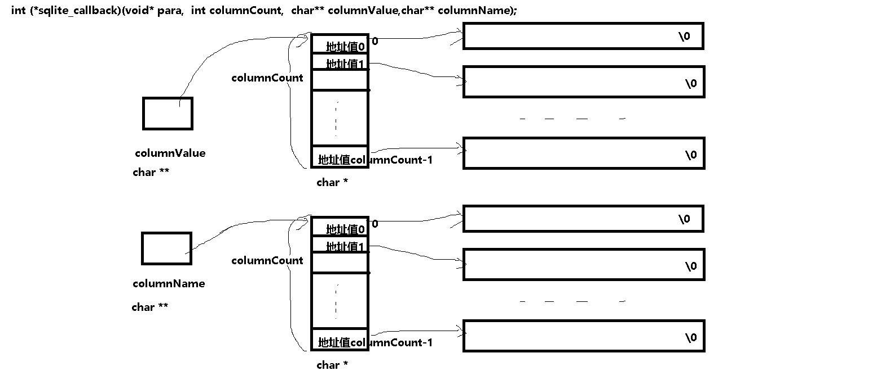

# 一、数据库简介

用文件存放数据的缺陷

数据库：持久存放数据的仓库

分类：

​	1. 关系型数据库

​	2. 非关系型数据库

数据库管理系统（ DBMS ）：对数据库中的数据进行统一管理和控制的软件系统。

***基本构成：一个DBMS操控多个数据库，每个数据库可以包含多张表，每张表由行列组成，每行称为记录，每列称为字段***

常见数据库管理系统：Oracle MySQL SQLServer  SQLite。。。


# 二、sqlite3简介

SQLite一个轻量级的嵌入式数据库，其源代码是C开发，完全开放

无服务器，提供了一套操作数据库的函数

零配置一无需管理配置；

储存在单一磁盘文件中的一个完整的数据库；

数据库文件可以在不同字节顺序的机器间自由共享；

支持数据库大小至2TB；

足够小，全部源码大致3万行c代码，250KB；

比目前流行的大多数数据库对数据的操作要快


安装：

```c
1.安装SQLite3
命令行下输入：sudo apt-get install sqlite3

2.安装SQLite3编译需要的工具包 
命令行下输入： sudo apt-get install libsqlite3-dev

如出现问题尝试：
sudo dpkg --purge --force-depends libsqlite3-0
sudo apt-get install libsqlite3-0
sudo apt-get install -f
sudo apt-get install libsqlite3-dev
sudo apt-get install sqlite3
```

https://www.runoob.com/sqlite/sqlite-installation.html

# 三、常用SQL语句训练

sqlite3是练习SQL语句一个小工具

sqlite3命令行支持两种命令：

1. .开头的内部命令（对sqlite3这个工具的一些设置操作）
2. 非.开头并以;结尾的SQL语句（重点）

3.1 支持的数据类型

```mysql
INTEGER或INT	值是一个带符号的整数，根据值的大小存储在 1、2、3、4、6 或 8 字节中。
REAL	值是一个浮点值，存储为 8 字节的 IEEE 浮点数字。
TEXT	值是一个文本字符串，使用数据库编码（UTF-8、UTF-16BE 或 UTF-16LE）存储  单引号括起的字符串
```

3.2 sqlite3内部命令(非SQL指令)

```
打开创建数据库   
sqlite3  xxx.db

sqlite3   先进入sqlite3的命令行
.open  xxx.db
```

```
查看sqlite命令行支持的命令：
sqlite>.help
```

```
查看所建数据库
sqlite> .databases
```

```
显示sqlite设置
sqlite> .show

SQL语句操作结果按列对齐  ----- 重要
sqlite> .mode column 
```

```
显示某表时是否显示表头 ----- 重要
sqlite> .headers on/off
```

```
显示数据中的表 ------ 重要
sqlite> .tables

显示指定表的结构
sqlite> .schema 表名 
```

```
退出sqlite命令行 ---- 重要
sqlite> .quit
```

3.3 建表

建议SQL语句关键字用全大写

```mysql
CREATE TABLE table_name(
   column1 datatype[(size)]  [PRIMARY KEY] [AUTOINCREMENT] [NOT NULL],
   column2 datatype,
   column3 datatype,
   .....
   columnN datatype,
);

[AUTOINCREMENT]:只能用于INTEGER 
[PRIMARY KEY]:主键,唯一标识表中的记录
[UNIQUE]:确保列值唯一

示例：
sqlite> CREATE TABLE student(id INTEGER PRIMARY KEY AUTOINCREMENT NOT NULL,name TEXT,sex TEXT(1),score REAL); 

/*数据库主键，指的是一个列或多列的组合，其值能唯一地标识表中的每一行，通过它可强制表的实体完整性。
主键主要是用于其他表的外键关联，以及本记录的修改与删除。
当创建或更改表时可通过定义 PRIMARY KEY 约束来创建主键。一个表只能有一个 PRIMARY KEY 约束，而且 PRIMARY KEY 约束中的列不能接受空值。
由于 PRIMARY KEY 约束确保唯一数据，所以经常用来定义标识列。
作用:
1）保证实体的完整性;
2）加快数据库的操作速度
3）在表中添加新记录时，DBMS会自动检查新记录的主键值，不允许该值与其他记录的主键值重复。
4) DBMS自动按主键值的顺序显示表中的记录。如果没有定义主键，则按输入记录的顺序显示表中的记录
*/

#联合主键：就是用多个字段联合起来唯一标识记录，这多个字段都不是唯一的，多个个字段可以分别重复
#这么设置的好处，可以很直观的看到某个重复字段的记录条数
#创建联合主键的表，在创建联合主键时，主键创建要放在所有字段最后面，否则会创建失败
CREATE TABLE database_name.table_name(
   column1 datatype[(size)],
   column2 datatype,
   column3 datatype,
   .....
   columnN datatype,
   PRIMARY KEY(column?,column?,....)
);

```

3.4 删表

```mysql
DROP TABLE 表名;

示例：
sqlite> CREATE TABLE ttt(xxx TEXT,yyy TEXT);
sqlite> DROP TABLE ttt;
```

3.5 插入记录

```mysql
通用：
INSERT INTO table_name [(column1, column2, column3,...columnN)]  VALUES (value1, value2, value3,...valueN);

不缺字段时：
INSERT INTO table_name VALUES (value1,value2,value3,...valueN); 
```

3.6 查询记录

```mysql
SELECT column1, column2, columnN FROM table_name [WHERE condition];

SELECT * FROM table_name [WHERE condition];

*表示查询结果显示所有字段
无WHERE子句则查询所有记录
```


3.7 WHERE子句

所谓子句就是不能是独立句子，只能成为一条语句的一部分

WHERE子句用来为一些操作指定条件

```mysql
WHERE condition

condition可以是单个条件或由AND、OR连接的多个条件

比较运算符支持:
=   !=   >   <    >=    <=  用法：字段名 运算符 值

IN()用法：字段名 IN(值1,值2,...,值n)   表示字段值为值1或值2或....

NOT IN()用法：字段名 NOT IN(值1,值2,...,值n)  表示字段值不为值1也不为值2也不为....

LIKE用法：字段名 LIKE 模式字串    模式字串中可以用%号表示任意多个字符，用_表示单个字符，默认不区分大小写

GLOB用法：字段名 GLOB 模式字串    模式字串中可以用*号表示任意多个字符，用?表示单个字符，区分大小写

IS NOT NULL用法：字段名 IS NOT NULL  判断字段值是否为空

IS NULL用法：字段名 IS NULL  判断字段值是否为空

BETWEEN AND用法：字段名 BETWEEN 值1 AND 值2   字段值>=值1 且 字段值<=值2

NOT反条件用法：字段名 NOT  其它条件
```

3.7 修改记录

```mysql
UPDATE table_name SET column1 = value1, column2 = value2...., columnN = valueN WHERE [condition];

无WHERE子句则对所有记录进行修改
```

3.8 删除记录

```mysql
DELETE FROM table_name WHERE [condition];

无WHERE子句则删除所有记录
```

3.9 sqlite3的函数

```mysql
datetime('now','localtime') ---- 产生当前日期时间的字符串

使用示例：
INSERT INTO Table_name VALUES(datetime('now','localtime'));

count(*) 求表行数
max(字段名)
min(字段名)
avg(字段名)
sum(字段名)

使用示例：
SELECT count(*) FROM Table_name;//输出指定表中的记录数量

/*判断某表是否存在，输出1为存在，否则为0*/
SELECT count(*)  FROM sqlite_master WHERE type='table' AND name = 'yourtablename';
/*sqlite_master是sqlite为每个数据库建立的维护用表格，其中：
  字段type指的该表中记录的类型，如果是表则为'table'
  字段name指的该表中记录的名称，如果是表则为表名
  字段sql指的该表中对应操作的SQL，如果是表则为建表的SQL语句
*/

/*判断某表字段是否存在，输出1为存在，否则为0*/
SELECT count(*)  FROM sqlite_master WHERE type='table' AND name = 'yourtablename' AND sql LIKE '%字段名%';
```

3.10 ORDER BY子句

```sqlite
ORDER BY 字段名 ASC 或 DESC

ASC升序
DESC降序
```

四、sqlite3函数库

```c
//头文件包含
#include <sqlite3.h>

/*链接选项
	-lsqlite3
*/

//1、打开/创建一个数据库
int sqlite3_open(const char *filename,  sqlite3 **ppDb );
/*
功能：打开指定的数据库，如果数据库并存在则创建并打开指定的数据库，并创建一个后续操作该数据库的引擎
参数：
	filename：带路径的数据库文件名
	ppdb：指向sqlite句柄的指针,调用前定义一个sqlite3 *指针变量，取该指针变量的地址
返回：成功  SQLITE_OK （值为0）,否则返回其他值。
*/

//2、如果打开数据库失败，open函数只是返回错误码，如果想要错误原因的字符串描述则调用该函数
const  char  *sqlite3_errmsg(sqlite3 *db);
/*        
	返回值：返回错误信息
*/

//3、回调函数执行sql语句
//更加适用于执行没有显示结果的或仅有一条显示结果的SQL语句
int sqlite3_exec(sqlite3* pDB, const char *sql, sqlite_callback callback, void*para, char** errMsg);
/*
功能：执行SQL语句，查询的结果返回给回调函数callback，多个结果的操作，每个结果都会调用一次callback
参数：
	pDB：数据库引擎的句柄。
	sql：待执行的SQL 语句字符串，以’\0’结尾，不以';'结尾。
	callback：回调函数，用来处理查询结果，如果不需要回调（比如做insert 或者delete 操作时），可以置NULL。
	para：要传入回调函数的指针参数，没有可以置为NULL。
	errMsg：返回错误信息，注意是指针的指针。调用前定义一个char *指针变量，传该指针变量的地址传给该形参。
	       使用完后需要调用sqlite3_free(errmsg);
返回值：执行成功返回SQLITE_OK，否则返回其他值
*/

//4、回调函数
typedef int (*sqlite_callback)(void* para,  int columnCount,  char** columnValue,char** columnName);
/*
功能：由用户处理查询的结果，每找到一条记录自动执行一次回调函数
参数：
	para：从sqlite3_exec()传入的参数指针；
	columnCount：查询到的这一条记录有多少个字段(即这条记录有多少列)；
	columnValue：查询出来的数据都保存在这里，它实际上是个1 维数组（不要以为是2 维数组），每一个元素都是一个char * 值，是一个字段内容（用字符串来表示，以‘\0’结尾）
	columnName：与columnValue 是对应的，表示这个字段的字段名称。
返回值：执行成功返回SQLITE_OK，否则返回其他值
*/

//5、关闭
int sqlite3_close(sqlite3 *ppDb);
/*
功能：关闭sqlite数据库。
参数：ppdb：数据库句柄。
返回值：成功返回0，失败返回错误码
*/

//6、释放   
void sqlite3_free(void * errMsg );
/*
功能：释放存放错误信息的内存空间
参数：errMsg: 返回错误信息
*/

//7、非回调来执行sql语句
//更加适用于执行有多条显示结果的SQL语句
int sqlite3_get_table(
      sqlite3 *db,          /* An open database */
      const char *zSql,     /* SQL to be evaluated */
      char ***pazResult,    /* Results of the query */
      int *pnRow,           /* Number of result rows written here */
      int *pnColumn,        /* Number of result columns written here */
      char **pzErrmsg       /* Error msg written here */
    );
/*
功能：非回调来执行sql语句
参数：
	db:数据库句柄
	zSql：要执行的SQL语句
	pazResult：查询结果，一维数组,定义一个char **的二级指针变量，调用函数时传该二级指针变量的地址，不使用应立即调用
	           sqlite3_free_table(result)进行释放
	pnRow：查询出多少条记录（查出多少行） 不包括字段名所在行
	pnColumn：多少个字段（查出多少列）
	pzErrmsg：错误信息
返回值：执行成功返回SQLITE_OK，否则返回其他值
注：pazResult的字段值是连续的，是一维数组不是二维数组，从第0索引到第 pnColumn- 1索引都是字段名称，从第 pnColumn索引开始，后面都是字段。
*/

//8、释放pazResult查询结果   
void sqlite3_free_table(char **pazResult);
/*
	参数：pazResult：查询结果，一维数组
*/

//9、多进程操作数据库
/*多进程操作同一数据库时，SQLite采用读写锁控制，为了避免sql语句执行时出现SQLITE_BUSY错误，建议采用如下措施*/
do 
{
	nRet = sqlite3_exec( m_db , buf , 0 , 0 , &pErrMsg );
        
    if (nRet == SQLITE_BUSY || nRet == SQLITE_LOCKED)
    {
		usleep(30 * 1000);
        continue;
    }
    else
    {
        break;
    }
} while(1);
```





